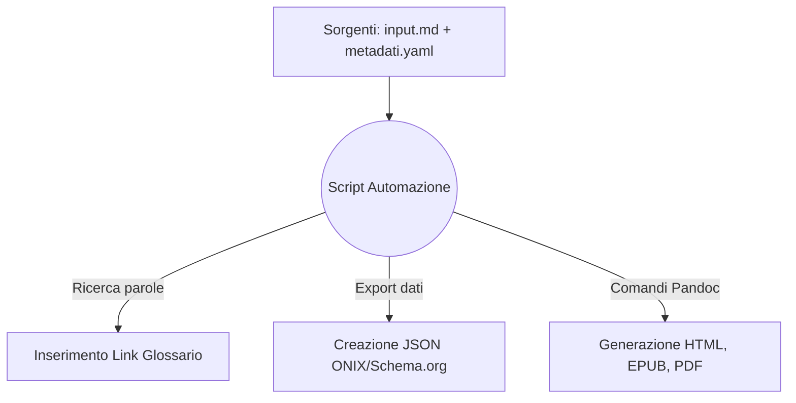

# One Health & Futuro Digitale: Dossier Strategico
## Analisi multidisciplinare su Salute, Clima, IA e Disinformazione per i professionisti dell'informazione

## Introduzione

Il presente documento illustra l'ideazione, l'analisi dei requisiti e lo sviluppo pratico di un flusso editoriale automatizzato per la pubblicazione digitale multicanale. Lo scopo principale del progetto risiede nella creazione di un "Dossier Strategico" incentrato su tematiche scientifiche di forte attualità, strutturato in modo da rispondere alle esigenze operative di giornalisti, redattori web e divulgatori che necessitano di informazioni chiare, verificate e facilmente consultabili nel proprio lavoro quotidiano.

L'infrastruttura di gestione documentale è stata costruita seguendo il paradigma del *Single Source Publishing* (SSP). Attraverso lo sviluppo di uno script di orchestrazione in linguaggio Python, un unico file di testo sorgente scritto in formato Markdown viene elaborato per generare in modo del tutto automatico tre formati finali di distribuzione: un sito web statico (Web-Book in HTML), un e-book in formato EPUB e un documento PDF ottimizzato per la stampa. L'automazione si occupa inoltre di estrarre e compilare i metadati descrittivi dell'opera secondo gli standard internazionali ONIX e Schema.org.

I codici sorgente, i comandi di conversione e le logiche di programmazione utilizzati per strutturare questa automazione derivano direttamente dagli esempi e dai flussi illustrati dal docente nei materiali didattici del corso. Tali snippet di codice sono stati analizzati, riadattati e riassemblati per funzionare in sequenza logica all'interno di questo specifico flusso di lavoro, dimostrando l'efficacia pratica e la sostenibilità degli strumenti presentati a lezione.

## Ideazione 

### Tema
Per il contenuto del dossier è stato scelto il concetto della "One Health", ovvero l'approccio integrato che riconosce come la salute umana, la salute animale e la tutela dell'ambiente naturale costituiscano un unico grande sistema strettamente interconnesso. Si tratta di un tema centrale nel dibattito scientifico contemporaneo, per il quale è richiesta un'informazione accurata e lontana da polarizzazioni o semplificazioni eccessive.

Il testo è stato suddiviso in sette capitoli fondamentali che mappano i trend e le discussioni scientifiche più rilevanti:
1. **Salute Globale:** L'impatto delle attività umane sugli ecosistemi e i fattori ambientali che favoriscono lo spillover e la diffusione delle zoonosi.
2. **Intelligenza Artificiale:** L'integrazione dei modelli computazionali e l'analisi dei rischi legati all'opacità ("Black Box") e ai bias degli algoritmi in medicina.
3. **Crisi Climatica:** Come la moderna scienza dell'attribuzione valuta e quantifica l'impatto antropico sui singoli eventi meteorologici estremi.
4. **Agricoltura Sostenibile:** La biofisica del suolo, le tecniche rigenerative di coltivazione *no-till* (semina diretta) e i meccanismi di sequestro del carbonio.
5. **Disinformazione:** Le dinamiche di diffusione delle notizie false sulle piattaforme social e le strategie di difesa cognitiva tramite il *prebunking*.
6. **Transizione Energetica:** L'impatto dei materiali e il ciclo di vita (LCA) delle tecnologie pulite rispetto alle fonti fossili tradizionali.
7. **Open Science:** L'importanza della trasparenza dei dati e dei server di preprint per superare la crisi di riproducibilità della ricerca scientifica.

### Destinatari
I destinatari del prodotto editoriale sono stati definiti delineando due profili professionali specifici (*personas*), inseriti in scenari d'uso concreti per orientare le scelte di usabilità e l'architettura dei formati:

* **Il Redattore Web:** Opera nelle redazioni dei giornali online con ritmi di lavoro molto frenetici e tempi di consegna ristretti. Deve scrivere articoli di approfondimento su argomenti complessi e tecnici senza avere un background accademico verticale nelle discipline scientifiche.
  * *Scenario d'uso:* A seguito di un'emergenza ambientale o meteorologica, consulta il sito web del progetto per un pezzo di approfondimento. Trova un'introduzione chiara al problema e le sintesi divulgative di studi autorevoli. Utilizzando i link ipertestuali diretti, scarica i documenti originali gratuiti ed esegue il fact-checking, concludendo l'articolo in tempo e con la certezza delle fonti riportate.
* **Il Divulgatore:** Crea contenuti per newsletter, blog o corsi di formazione. Cerca materiali affidabili, verificati e ben organizzati da poter studiare e rielaborare con cura in un secondo momento.
  * *Scenario d'uso:* Durante uno spostamento in treno, legge il dossier in modalità offline sul suo e-reader. Grazie al formato EPUB, naviga facilmente tra i capitoli usando l'indice ipertestuale. Incontrando un termine tecnico o specialistico, seleziona il collegamento e legge la spiegazione nel glossario finale senza perdere il segno. Trova la suddivisione modulare in capitoli molto logica e decide di usarla come scaletta per il suo prossimo progetto divulgativo.

### Requisiti di accettazione
Per ritenere il prodotto editoriale valido e pronto per il rilascio, sono stati soddisfatti i seguenti requisiti di accettazione tecnici e di contenuto:
* **Separazione tra contenuto e stile:** Il file sorgente Markdown deve contenere esclusivamente il testo semantico e la marcatura logica. Qualsiasi indicazione visiva o istruzione grafica locale (colori, margini, spaziature) deve essere esclusa e gestita tramite fogli di stile esterni.
* **Adattabilità e fluidità dell'e-book:** L'EPUB deve superare la validazione strutturale e deve adattarsi a qualsiasi schermo o preferenza dell'utente (dimensione dei caratteri, ereditarietà dei font) senza mostrare difetti visivi, supportando nativamente la Modalità Notte.
* **Metadati standardizzati:** I file con le informazioni descrittive dell'opera devono rispettare le specifiche sintattiche richieste dagli standard internazionali, garantendo la leggibilità da parte dei sistemi di catalogazione.

A livello organizzativo, si segnala una specifica modifica strutturale apportata alla directory del progetto `Progetto_editoria`: la presente relazione (`relazione.md`) e l'immagine del logo dell'Ateneo (`minerva.jpg`) sono state allocate all'interno di una sottocartella dedicata chiamata `Docs`. Questa scelta permette di mantenere pulito l'ambiente principale del progetto, separando nettamente la documentazione testuale descrittiva dai file sorgente e dai codici software di automazione.

## Processo di Produzione

### Acquisizione dei contenuti e ruolo dell'Intelligenza Artificiale
Gli articoli scientifici di partenza utilizzati per comporre il dossier sono stati individuati tramite l'interrogazione di database accademici, selezionando 21 pubblicazioni recenti distribuite in modalità Open Access per garantirne la libera consultabilità. L'intero processo di studio delle fonti, la mediazione linguistica, l'ideazione della struttura dei capitoli e la scrittura materiale dei testi in italiano sono il frutto di un lavoro condotto in modo completamente autonomo.

L'Intelligenza Artificiale generativa (nello specifico il modello Gemini) è stata integrata all'interno del flusso di produzione in modo consapevole, circoscritto e assolutamente non massiccio. L'apporto della tecnologia è stato richiesto esclusivamente per due aspetti di supporto ben definiti: la generazione grafica dell'immagine di copertina del dossier e un limitato aiuto tecnico in fase di debugging per risolvere alcuni errori di sintassi emersi durante la scrittura dello script Python. L'architettura complessiva del flusso, l'organizzazione delle cartelle e le logiche di trasformazione sono state realizzate studiando i documenti del corso, senza delegare all'IA il lavoro di progettazione editoriale e di analisi concettuale.

### L'assemblaggio dei codici del corso
Il flusso di gestione documentale è governato dallo script orchestratore `main.py`, il quale mette in pratica in modo sequenziale le tecnologie e i comandi software illustrati nei PDF didattici del corso, collegandoli all'interno di una pipeline automatica:

1. **Gestione del Testo (Markdown):** Lo script legge il file sorgente `input.md`, scritto rispettando la sintassi di marcatura leggera definita in *LT2-FormatiMarcatura-MarkDown.pdf*. Sfruttando le funzioni del modulo `re` di Python per le espressioni regolari, il codice analizza il testo e inserisce automaticamente i collegamenti ipertestuali verso il glossario solo alla prima occorrenza di ciascun termine, generando un file temporaneo denominato `input_processato.md`. Questa automazione evita l'inserimento manuale dei tag, riducendo i tempi redazionali.
2. **Estrazione dei Metadati:** I dati descrittivi compilati dall'autore nel file di configurazione YAML vengono mappati dal codice e convertiti in automatico in file JSON strutturati conformi agli standard ONIX e Schema.org, applicando i concetti organizzativi illustrati in *LM4-FlussiLavoroEditoriale-Metadati.pdf*.
3. **Allineamento delle risorse:** Tramite le funzioni del modulo `shutil`, lo script copia il file dello stile web all'interno delle cartelle del sito statico, garantendo la corretta associazione dei file grafici nel file system ed evitando percorsi interrotti.
4. **Compilazione con Pandoc:** Lo script invoca il convertitore universale Pandoc utilizzando gli esatti comandi e parametri presentati in *LT6-TrasformazioniFormati-Pandoc.pdf*. Pandoc unisce la sorgente testuale con i dati bibliografici del database BibTeX (`bibliografia.bib`), generando in un solo passaggio i tre formati finali. Al termine, il file temporaneo viene rimosso per garantire la pulizia delle directory.



### Scelte grafiche e di stile
L'aspetto visivo del progetto è stato mantenuto volutamente semplice, pulito e funzionale, applicando in modo pratico le indicazioni del corso ed evitando configurazioni grafiche ridondanti che avrebbero appesantito il codice:

* **Sito Web (HTML):** In linea con i concetti di pubblicazione affrontati in *LM6-WebBook.pdf*, si è scelto uno stile grafico essenziale per favorire la lettura on-line tramite browser. Il layout prevede l'uso di sfondi chiari e testo scuro per garantire un contrasto equilibrato. I titoli adottano una tonalità blu navy, mentre il corpo del testo è impostato in grigio ardesia scuro per mantenere l'interfaccia ordinata. L'indice generale e i riassunti dei capitoli sono inseriti all'interno di riquadri geometrici semplici con angoli arrotondati e ombreggiature leggere, facilitando la navigazione sia da desktop che da dispositivi mobili.
* **E-book (EPUB):** Applicando le buone pratiche descritte in *LM5-LibroElettronico.pdf* per i libri fluidi, si è deciso di rimuovere dal file `epub.css` qualsiasi colore fisso o sfondo particolare. Il foglio di stile si limita a dare istruzioni essenziali sullo spazio tra i paragrafi e sui rientri dei titoli. Grazie a questa impostazione leggera, il file rispetta l'inchiostro elettronico (e-ink) degli e-reader e si integra perfettamente con i software di lettura; se l'utente attiva la Modalità Notte, lo schermo diventa nero e il testo bianco in modo del tutto automatico, senza mostrare blocchi visivi illeggibili.
* **Documento per la stampa (PDF):** L'impaginazione del PDF è stata affidata alle regole tipografiche formali gestite dal motore LaTeX, come illustrato in *LT7-FormatiMarcatura-Latex.pdf*. Il sistema genera un layout classico e professionale, occupandosi in autonomia di calcolare i margini della pagina (impostati a 2.5cm), giustificare rigorosamente il testo, inserire le note a piè di pagina e gestire i salti di pagina obbligatori prima dell'inizio di ogni capitolo.

## Valutazione dei risultati raggiunti

### Valutazione del flusso di produzione
L'introduzione della pipeline automatizzata basata sul Single Source Publishing (concetto approfondito in *LM3-ProcessoEditoriale.pdf*) ha permesso di riscontrare notevoli vantaggi operativi:
* **Riduzione dei tempi di gestione documentale:** Il tempo richiesto per l'aggiornamento, la compilazione e la pubblicazione dell'intero catalogo multiformato è sceso a meno di tre secondi complessivi (il tempo di calcolo dello script Python).
* **Riduzione degli errori:** Avendo centralizzato i contenuti in un unico punto (`input.md`), si azzera il rischio di dimenticare una correzione o di disallineare i testi tra le edizioni web, e-book e cartacea.
* **Miglioramento della qualità dei documenti:** Il sorgente Markdown rimane puramente semantico e privo di istruzioni grafiche locali. La gestione automatica tramite RegEx dei link al glossario garantisce collegamenti precisi e privi di refusi manuali.
* **Miglioramento del livello di accettazione della tecnologia:** L'aver riassemblato e personalizzato i codici forniti a lezione ha permesso di disporre di un'infrastruttura trasparente, stabile e facilmente modificabile in caso di futuri aggiornamenti.
* **Raggiungimento di nuovi canali di distribuzione e scenari d'uso:** La separazione logica degli stili ha permesso di coprire contemporaneamente il sito web responsive, la lettura fluida su e-reader e il file pronto per la stampa, soddisfacendo tutti i requisiti espressi dalle *personas*.

### Confronto con lo stato dell'arte
* **Flusso ASIS (Metodo tradizionale manuale):** L'autore scrive il testo su un word processor. Successivamente deve impaginarlo manualmente per il PDF, copiare e incollare i paragrafi all'interno di un CMS per la pubblicazione web e utilizzare un software terzo per convertire il file in e-book. Qualsiasi successiva correzione ortografica richiede un intervento manuale separato su tre ambienti differenti, moltiplicando i tempi e il rischio di errore umano.
* **Flusso TOBE (Il sistema SSP proposto nel progetto):** L'intero contenuto risiede esclusivamente nel file sorgente Markdown. Ogni modifica viene eseguita una sola volta. Avviando lo script `main.py`, l'infrastruttura rigenera e riallinea istantaneamente il sito web, l'e-book, il PDF e i file dei metadati, garantendo la coerenza dei dati su tutti i canali di distribuzione.

### Limiti emersi
Il sistema presenta alcune limitazioni di natura tecnica. Il workflow risente di una stretta dipendenza dall'ambiente locale, richiedendo l'installazione preventiva sulla macchina di Python 3, del convertitore Pandoc e dell'intera suite di compilazione XeLaTeX. Inoltre, si riscontra una parziale discontinuità tra i modelli di formattazione: il motore LaTeX utilizzato per il PDF non è in grado di interpretare direttamente le regole grafiche scritte nei file CSS usati per le pagine web. Questo ha obbligato a gestire le direttive geometriche per la stampa all'interno dei campi di configurazione YAML del file sorgente, determinando una parziale eccezione alla separazione totale degli stili.

## Conclusioni
I risultati ottenuti dimostrano che gli obiettivi definiti dai casi d'uso sono stati pienamente raggiunti. Il "Dossier Strategico" si configura come un prodotto multicanale solido, verificato e facilmente aggiornabile. L'applicazione del Single Source Publishing ha dimostrato la sua efficacia pratica, svincolando la fase di scrittura dalle logiche di impaginazione visiva. L'integrazione e il riadattamento dei codici del corso hanno permesso di strutturare un'automazione stabile, capace di valorizzare la flessibilità dei formati aperti. L'utilizzo mirato e limitato dell'Intelligenza Artificiale ha agevolato piccoli compiti di supporto grafico e sistemistico, lasciando all'autore il totale controllo e la paternità intellettuale dell'opera. Come sviluppo futuro, si prospetta il trasferimento della pipeline su server cloud (tramite GitHub Actions), per abilitare la compilazione automatica ad ogni commit sul repository remoto, rendendo il flusso del tutto indipendente dalle risorse della macchina locale.

## Bibliografia e sitografia

* Articoli scientifici Open Access recuperati dai database bibliografici e indicizzati nel file `bibliografia.bib`.
* Materiale didattico del corso di Editoria Digitale (Università degli Studi di Milano). I codici, le logiche e i comandi utilizzati per l'automazione del progetto derivano dallo studio e dal riadattamento dei seguenti documenti ufficiali del docente:
  * *LT2-FormatiMarcatura-MarkDown.pdf* (Per la sintassi testuale del sorgente).
  * *LM3-ProcessoEditoriale.pdf* (Per le logiche del Single Source Publishing).
  * *LM4-FlussiLavoroEditoriale-Metadati.pdf* (Per la struttura YAML e l'estrazione in Schema.org e ONIX).
  * *LM5-LibroElettronico.pdf* (Per l'impostazione grafica fluida dell'EPUB).
  * *LM6-WebBook.pdf* (Per lo stile e l'impostazione del Web-Book).
  * *LT6-TrasformazioniFormati-Pandoc.pdf* (Per i comandi di compilazione e fusione dei file tramite Pandoc).
  * *LT7-FormatiMarcatura-Latex.pdf* (Per la gestione tipografica del formato cartaceo tramite LaTeX).
```