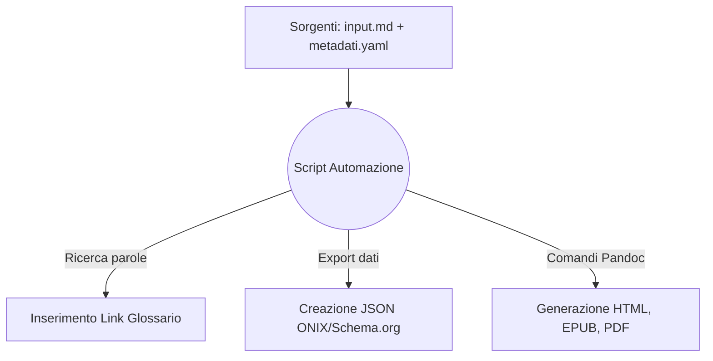

# One Health & Futuro Digitale: Dossier Strategico
Analisi multidisciplinare su Salute, Clima, IA e Disinformazione per i professionisti dell'informazione

## Introduzione

Il presente documento illustra in modo dettagliato l'ideazione, l'analisi dei requisiti e lo sviluppo pratico di un flusso editoriale automatizzato applicato alla pubblicazione digitale multicanale. Lo scopo principale del progetto risiede nella pianificazione e nella creazione assistita di un "Dossier Strategico" incentrato su tematiche scientifiche di forte attualità. L'opera è strutturata specificamente per rispondere alle stringenti esigenze operative di categorie professionali quali giornalisti, redattori web, blogger e divulgatori scientifici, offrendo loro un compendio informativo chiaro, verificato e facilmente consultabile durante lo svolgimento delle attività lavorative quotidiane.

L'intera infrastruttura di gestione documentale è stata sviluppata implementando il paradigma del *Single Source Publishing* (SSP). Questo approccio metodologico prevede che l'intero contenuto testuale e informativo risieda all'interno di un unico file sorgente scritto in formato Markdown, mantenendo il testo puro completamente separato dai suoi successivi attributi di formattazione o impaginazione visiva. Per orchestrare l'intera pipeline di trasformazione e conversione dei dati è stato implementato uno script centralizzato in linguaggio Python 3. Questo applicativo elabora il file sorgente, applica filtri di arricchimento semantico coordinando al contempo le istruzioni del convertitore universale Pandoc.

Grazie a questa architettura, l'esecuzione di un singolo comando permette al sistema di generare in modo del tutto automatico tre formati finali di distribuzione indipendenti e complementari: un sito web statico (Web-Book in HTML), un e-book in formato EPUB e un documento PDF ad alta risoluzione ottimizzato per la stampa cartacea. Parallelamente alla compilazione dei formati di lettura, lo script provvede all'estrazione, alla mappatura e alla scrittura dei metadati descrittivi dell'opera secondo gli standard internazionali ONIX e Schema.org. I codici sorgente, le istruzioni di compilazione e le logiche di sistema impiegate derivano direttamente dagli esempi e dalle strutture analizzati durante le lezioni del corso. Tali componenti sono stati studiati, personalizzati e riassemblati per funzionare in sequenza logica, dimostrando sul piano pratico come l'automazione digitale possa ridurre drasticamente i tempi di rilascio ed eliminare i tipici errori di copiatura manuale dei dati.

## Ideazione 

### Tema
Per la definizione del nucleo tematico del dossier, l'indagine si è focalizzata sulle questioni scientifiche più complesse e polarizzanti della comunicazione contemporanea. Il filo conduttore dell'intera opera è identificato nel paradigma della "One Health", ovvero l'approccio integrato e multidisciplinare che riconosce come la salute degli esseri umani, la salute degli animali e la tutela degli ecosistemi naturali costituiscano un unico grande sistema indissolubilmente interconnesso. Si tratta di un ambito caratterizzato da una fortissima tendenza di attenzione da parte dei media e dell'opinione pubblica, ma costantemente esposto ai rischi legati a fenomeni di infodemia, fake news o eccessive semplificazioni giornalistiche.

Al fine di offrire una panoramica esaustiva e fondata su prove empiriche, il dossier è stato strutturato in sette macro-capitoli di forte rilevanza sociale e scientifica:
1. **Salute Globale:** Analisi del paradigma "One Health" e dei fattori antropici (frammentazione degli habitat, urbanizzazione) che favoriscono lo spillover virale e la diffusione delle zoonosi.
2. **Intelligenza Artificiale:** L'integrazione dei modelli predittivi e dei sistemi di machine learning in ambito medico, con un focus critico sui problemi etici dell'opacità algoritmica ("Black Box") e dei bias nei dati clinici.
3. **Crisi Climatica:** La decodifica degli eventi meteorologici estremi analizzati attraverso le metodologie della moderna scienza dell'attribuzione.
4. **Agricoltura Sostenibile:** Studio della biofisica del suolo, delle tecniche rigenerative di semina diretta (*no-till*) e dei relativi cicli di sequestro del carbonio nel terreno.
5. **Disinformazione:** Le dinamiche psicologiche e algoritmiche di diffusione delle notizie false sulle piattaforme social e le strategie di profilassi cognitiva tramite il *prebunking*.
6. **Transizione Energetica:** La valutazione della materialità dello shifting verso le fonti rinnovabili, analizzata attraverso i costi estrattivi dei minerali critici e lo standard del *Life Cycle Assessment* (LCA).
7. **Open Science:** La trasparenza dei dati e l'importanza dei server di preprint come risposta digitale istituzionale alla crisi di riproducibilità della ricerca scientifica contemporanea.

### Destinatari
Il profilo dei destinatari del prodotto editoriale è stato definito in modo analitico attraverso la metodologia delle *personas*, individuando due macro-categorie professionali caratterizzate da specifiche necessità di consultazione dei dati e inserite all'interno di scenari d'uso concreti:

* **Persona 1: Il Redattore Web o Giornalista Digitale.** Lavora all'interno di redazioni di testate online, agenzie di stampa o blog d'informazione generalista. È caratterizzato da flussi di lavoro estremamente frenetici, scadenze temporali strette (spesso inferiori alle poche ore per la consegna di un pezzo) e dalla necessità di trattare argomenti scientifici molto complessi senza possedere un background accademico specialistico nelle discipline mediche o ambientali. Necessita di sintesi chiare, prive di gergo ultra-tecnico, ma collegate direttamente alle fonti ufficiali per poter effettuare rapidamente il fact-checking.
  * *Scenario d'uso:* In concomitanza con un'improvvisa ondata di calore anomala, il redattore riceve l'incarico di produrre un articolo di approfondimento. Accedendo al Web-Book HTML tramite browser, trova immediatamente un'introduzione giornalistica che inquadra il problema e il riassunto strutturato di studi accademici correlati. Sfruttando i link ipertestuali diretti, può scaricare i paper scientifici originali in Open Access, blindando l'affidabilità del proprio pezzo in tempi record e senza imbattersi in paywall commerciali.
* **Persona 2: Il Divulgatore Scientifico o Curatore di Newsletter Tematiche.** Opera come professionista indipendente, consulente, autore di podcast o formatore. Dispone di tempi di redazione più flessibili, possiede un livello di competenza medio-alto e predilige materiali fortemente strutturati, modulari e approfonditi dal punto di vista dell'organizzazione concettuale. Consulta i materiali prevalentemente in mobilità e predilige l'uso di dispositivi di lettura digitali dedicati.
  * *Scenario d'uso:* Durante uno spostamento in treno, il divulgatore consulta il dossier in modalità offline sul proprio e-reader a inchiostro elettronico (e-ink). Utilizzando la versione EPUB, naviga agevolmente la struttura dei capitoli tramite l'indice ipertestuale cliccabile. Incontrando un termine tecnico specialistico, seleziona il collegamento ipertestuale che lo rimanda all'istante alla definizione corrispondente all'interno del glossario finale, potendo usare la struttura logica del testo come scaletta per pianificare il numero successivo della propria newsletter.

### Requisiti di accettazione
Per poter considerare il flusso di produzione e i relativi output editoriali pienamente validi e conformi agli obiettivi didattici e professionali del progetto, sono stati stabiliti e soddisfatti i seguenti requisiti di accettazione tecnici, contenutistici e organizzativi:

* **Rigorosa separazione tra contenuto semantico e presentazione visiva:** Il file sorgente Markdown (`input.md`) deve contenere esclusivamente il testo puro, i titoli e i marcatori logici della struttura. È fatto assoluto divieto di inserire tag grafici locali, attributi di formattazione inline o blocchi di stile incorporati nel testo. L'intera resa estetica deve essere demandata a fogli di stile CSS esterni o a configurazioni centralizzate nel preambolo YAML, garantendo la totale indipendenza del dato testuale.
* **Adattabilità, interoperabilità e fluidità dell'e-book:** Il formato di output EPUB deve superare senza eccezioni i test di validazione strutturale dello standard tramite l'applicativo *ePubCheck*. Dal punto di vista del design, il foglio di stile associato deve risultare privo di regole cromatiche rigide (sfondi o colori dei caratteri fissati in modo assoluto); il file deve integrarsi in modo fluido con i motori di rendering dei dispositivi di lettura, ereditando le preferenze di accessibilità impostate dall'utente e supportando in modo nativo la Modalità Notte senza generare difetti visivi o porzioni di testo illeggibili.
* **Validità semantica e standardizzazione dei metadati:** Le informazioni descrittive dell'opera dichiarate dall'autore devono essere estratte in modo automatizzato dal sistema e formattate in file JSON strutturati e validi. Tali file devono rispondere rigorosamente alle specifiche dello standard ONIX (per l'integrazione nelle piattaforme distributive commerciali e nei cataloghi bibliotecari) e dello standard Schema.org in formato JSON-LD (per l'ottimizzazione dell'indicizzazione semantica sui motori di ricerca web).
* **Integrità ipertestuale, bibliografica e strutturale delle directory:** Ogni richiamo citazionale inserito nel testo deve trovare l'esatta e automatica corrispondenza nel blocco delle referenze bibliografiche finali tramite l'elaborazione del file BibTeX. I collegamenti rivolti ai termini del glossario devono attivarsi in modo automatico alla prima occorrenza di ogni parola chiave all'interno del testo. Sul piano organizzativo dell'ambiente di lavoro, la directory principale `Progetto_editoria` deve ospitare nella radice solo i file di gestione generale (`README.md`, `.gitignore`), isolando l'intera documentazione d'esame (il logo `minerva.jpg`, il file `Traccia d'esame.pdf` e la cartella `Relazione` con al suo interno `relazione.md` e `relazione.pdf`) dentro la cartella dedicata `Docs`, assicurando un'architettura dei file pulita, logica e facilmente manutenibile.

### Canali di distribuzione
Il flusso di lavoro è stato configurato per presidiare tre canali di distribuzione principali, applicando regole grafiche differenziate per massimizzare l'efficacia di ciascun mezzo di fruizione:

1. **Canale Web (Sito Statico responsive):** L'output di riferimento è il file `index.html` posizionato nella directory del sito. L'identità visuale mira a trasmettere un senso di autorevolezza istituzionale. Tramite il foglio di stile `style.css`, viene impostato un layout a griglia pulita con una palette basata sul blu navy per i titoli e il grigio ardesia scuro per il testo, garantendo un contrasto equilibrato. L'indice generale e i riassunti dei capitoli sono racchiusi in box geometrici lineari con angoli arrotondati e ombreggiature leggere, facilitando la consultazione sia da desktop che da schermi mobile.
2. **Canale E-Reader (E-book Marketplace):** L'output è il file `output.epub`. In questo canale la priorità è l'adattabilità. Attraverso il file `epub.css`, sono stati eliminati i colori rigidi di sfondo o di testo, limitando le regole grafiche ai soli rientri dei paragrafi e alle spaziature dei titoli. Il testo risulta così fluido e si adatta in modo naturale ai display e-ink e alle personalizzazioni del lettore.
3. **Canale Stampa (Documento PDF):** L'output è il file `output.pdf`. Generato mediante il motore tipografico LaTeX, il documento risponde rigidamente ai canoni formali accademici: testo giustificato, margini speculari ampi per agevolare la lettura su carta, numerazione automatica, gestione delle note a piè di pagina e inserimento di interruzioni di pagina obbligatorie prima dell'inizio di ogni capitolo.

## Processo di Produzione

### Acquisizione dei contenuti
La fase di acquisizione ha previsto una ricerca sistematica su repository scientifici accademici per raccogliere il compendio delle fonti. Sono stati selezionati 21 articoli scientifici di rilievo internazionale, scelti rigorosamente tra quelli provvisti di licenza Open Access per garantirne la consultabilità gratuita. Nella pianificazione del flusso, le risorse e i costi sono stati mappati in tre distinte categorie:
* **Fonti libere a costo zero economico:** Gli articoli accademici originari e i software utilizzati (Python, Pandoc) sono open source e privi di costi di licenza.
* **Contenuti generati automaticamente:** La formattazione della bibliografia (gestita dall'estensione `citeproc` di Pandoc) e la compilazione dei metadati ONIX e Schema.org avvengono in modo automatico tramite codice, con un costo in termini di ore-lavoro manuali pari a zero.
* **Lavoro di redazione manuale ad alto costo di tempo:** Lo studio analitico dei singoli paper in lingua inglese e la stesura delle sintesi divulgative in lingua italiana all'interno del file `input.md` ha richiesto un considerevole lavoro di mediazione concettuale per rendere i dati accessibili a un pubblico non specializzato, rappresentando il reale investimento di tempo della fase redazionale.

### Gestione documentale
Il flusso di gestione documentale è interamente governato dallo script orchestratore `main.py`, sviluppato per connettere in sequenza automatica le logiche e i comandi analizzati durante le lezioni del corso ed eliminare i passaggi ripetitivi:

1. **Inizializzazione e Lettura:** Lo script verifica l'esistenza delle cartelle nel file system, acquisisce le variabili dichiarate nel file `metadati.yaml` e carica il testo semantico in Markdown da `input.md`.
2. **Pre-processing tramite espressioni regolari:** Sfruttando le funzioni del modulo `re` di Python, il programma scansiona il testo. Individua i termini tecnici inclusi nel dizionario del glossario e inserisce automaticamente i marcatori ipertestuali alla prima occorrenza di ciascuna parola chiave, generando il file temporaneo `input_processato.md`. Questa automazione riduce i tempi redazionali ed evita inserimenti manuali.
3. **Estrazione dei metadati strutturati:** Le variabili dello YAML vengono elaborate e formattate dal codice in autonomia, scrivendo i file JSON conformi agli standard ONIX e Schema.org.
4. **Allineamento della grafica web:** Tramite il modulo `shutil`, lo script crea la cartella di destinazione dei CSS del sito e vi copia fisicamente il file `style.css` prelevato dalla cartella degli stili, assicurando l'integrità del design ed evitando percorsi interrotti o link rotti.
5. **Compilazione via Pandoc:** Lo script invoca il convertitore Pandoc passandogli il testo processato, la copertina, il database delle citazioni (`01_Sorgenti/bibliografia.bib`) e i rispettivi stili grafici, compilando simultaneamente HTML, EPUB e PDF. Al termine del processo, il file temporaneo `input_processato.md` viene rimosso dal sistema per garantire la pulizia delle directory.

### Tecnologie adottate
Le scelte tecnologiche sono state guidate dai principi dei formati aperti e dell'indipendenza del dato, assicurando un contributo diretto alla risoluzione degli scenari d'uso ipotizzati:

* **Markdown (`.md`):** Consente di concentrarsi sulla semantica e sulla struttura logica dei testi, svincolando la scrittura dalle logiche di impaginazione visiva.
* **YAML (`.yaml`):** Permette di centralizzare tutte le variabili del libro (titolo, autore, ISBN) e le direttive di compilazione in un formato testuale facilmente leggibile.
* **Python 3:** Costituisce il motore dell'automazione, sfruttando i moduli integrati `re` per la manipolazione istantanea del testo e `shutil` per la gestione automatica dei file nel file system.
* **Pandoc e XeLaTeX:** Pandoc opera come convertitore universale, traducendo i marcatori e formattando la bibliografia tramite l'estensione `citeproc`. Il motore *XeLaTeX* garantisce la resa tipografica del PDF gestendo con precisione i margini e l'allineamento per la stampa.

| Dimensione Editoriale | Contributo per il Canale Web (HTML) | Contributo per il Canale E-Book (EPUB) |
| --- | --- | --- |
| **Sintassi Sorgente** | Elaborata in tag HTML semantici standard (`<h1>`, `
`). | Convertita nella struttura a capitoli XHTML interna all'EPUB. |
| **Applicazione del Design** | Gestita via browser tramite `style.css`, con regole pulite e box geometrici. | Demandata a `epub.css`, fluida e priva di colori fissi per rispettare gli e-reader. |
| **Automazione File** | Lo script copia fisicamente il foglio di stile nella directory del sito. | Lo stile viene incorporato direttamente all'interno del pacchetto da Pandoc. |

### Esecuzione del flusso
Tutti i materiali, i codici sorgente completi, i fogli di stile, i database bibliografici e gli output generati sono liberamente consultabili e riproducibili accedendo al repository Git pubblico del progetto:
* **Repository GitHub:** `https://github.com/Envalope/Progetto-Editoria-Digitale-Appello-12-06-2026-Valentini-Enrico`

L'intero processo di compilazione multicanale si esegue avviando lo script `main.py` posizionato all'interno della directory di lavoro.

### Utilizzo di intelligenza artificiale generativa
L'Intelligenza Artificiale generativa (modello Gemini) è stata integrata all'interno del flusso di gestione documentale in modo consapevole, mirato e assolutamente non massiccio, limitandone l'apporto alle sole fasi di *Progettazione Grafica* e *Revisione del Codice*.

L'interazione con il modello è avvenuta secondo un approccio di prompt engineering di tipo *task-oriented*, focalizzato su obiettivi specifici:
1. **Sintassi Python (RegEx):** Richiesta di supporto tecnico per strutturare le espressioni regolari del pre-processing, assicurando che l'iniezione automatica dei link al glossario avvenisse solo alla prima occorrenza di un termine all'interno di un paragrafo, evitando ridondanze.
2. **Debugging dei fogli di stile CSS:** Analisi delle specifiche del formato EPUB per identificare e rimuovere i vincoli cromatici rigidi che bloccavano il corretto funzionamento della modalità notte sui dispositivi di lettura digitali.
3. **Generazione dell'immagine di copertina:** Utilizzo dei modelli di generazione dell'IA per creare la componente grafica della copertina del dossier, impostata sul concetto visivo dell'interconnessione One Health.

La validazione della qualità degli output generati dall'IA è stata eseguita attraverso un rigoroso protocollo basato su cicli di test locali, eseguendo lo script da terminale, controllando i log di errore e analizzando i risultati sui browser tramite i developer tools. L'uso della tecnologia generativa ha ridotto i tempi di sviluppo software, evidenziando tuttavia limiti nella gestione automatica dei percorsi relativi delle cartelle, corretti grazie all'intervento critico umano. La stesura dei testi e l'architettura dei contenuti rimangono il risultato esclusivo di un lavoro autonomo.

## Valutazione dei risultati raggiunti

### Valutazione del flusso di produzione
L'analisi dei risultati evidenzia il pieno soddisfacimento dei requisiti e dei casi d'uso stabiliti in fase di ideazione, mostrando miglioramenti tangibili valutati secondo i parametri del corso:
* **(i) Riduzione dei tempi di gestione documentale:** Il tempo richiesto per la compilazione e la pubblicazione dell'intero catalogo multiformato (Web, EPUB, PDF) è sceso a meno di tre secondi complessivi dall'avvio dello script.
* **(ii) Riduzione degli errori:** Centralizzando i testi nell'unica sorgente Markdown (`input.md`), il rischio di riscontrare contenuti disallineati o refusi non corretti tra le diverse edizioni è stato completamente azzerato.
* **(iii) Miglioramento della qualità dei documenti:** Il sorgente Markdown risulta privo di tag grafici spuri, preservando la purezza semantica del testo. La gestione automatica tramite RegEx dei link interni elimina la presenza di riferimenti errati o orfani nel glossario.
* **(iv) Miglioramento del livello di accezione della tecnologia:** L'aver riutilizzato e riadattato i codici forniti a lezione ha permesso di disporre di un'infrastruttura trasparente, stabile e facilmente modificabile per progetti futuri.
* **(v) Raggiungimento di nuovi canali di distribuzione:** La separazione logica dei CSS ha permesso di coprire contemporaneamente il sito web responsive e la lettura fluida su e-reader.
* **(vi) Soddisfacimento di nuovi scenari d'uso:** I formati generati rispondono perfettamente alle necessità delle *ampie personas* profilate, garantendo immediatezza d'uso per il redattore web e portabilità offline per il divulgatore.

### Confronto con lo stato dell'arte
* **Flusso ASIS (Metodo tradizionale manuale):** L'autore redige il testo, poi deve formattarlo e impaginarlo manualmente su Word per ottenere il PDF per la stampa. Per la pubblicazione web, deve copiare e incollare i paragrafi all'interno di un CMS (come WordPress) ricreando la struttura dei titoli. Per l'e-book, deve importare il testo in un terzo software (come Calibre) e impostare nuovamente la grafica. Qualsiasi successiva correzione ortografica richiede tre interventi manuali separati, dilatando i tempi e moltiplicando il rischio di inconsistenza dei dati.
* **Flusso TOBE (Il sistema SSP proposto nel progetto):** L'intero contenuto risiede unicamente nel file sorgente Markdown. Ogni modifica viene eseguita una sola volta in quell'unico punto. Mandando in esecuzione lo script `main.py`, il sistema si occupa di elaborare il testo e istruire Pandoc per rigenerare istantaneamente il sito web, l'e-book, il PDF tipografico e i file dei metadati, garantendo l'allineamento automatico e immediato di tutti i canali di distribuzione con un solo comando.

### Limiti emersi
Il sistema presenta alcune limitazioni di natura tecnica. Il workflow risente di una stretta dipendenza dall'ambiente locale, richiedendo l'installazione preventiva sulla macchina di Python 3, del convertitore Pandoc e della suite XeLaTeX. Inoltre, si riscontra una parziale discontinuità tra i modelli di formattazione: il motore LaTeX utilizzato per il PDF non è in grado di interpretare direttamente le regole grafiche scritte nei file CSS usati per le pagine web. Questo ha obbligato a gestire le direttive geometriche e i margini della pagina stampata direttamente all'interno delle configurazioni YAML del documento sorgente, determinando una parziale eccezione alla separazione totale degli stili.

## Conclusioni
I risultati ottenuti dimostrano che gli obiettivi definiti dai casi d'uso sono stati pienamente raggiunti. Il "Dossier Strategico" si configura come un prodotto multicanale solido, verificato e facilmente aggiornabile. L'applicazione del paradigma Single Source Publishing ha dimostrato la sua efficacia pratica, svincolando la fase di scrittura dalle logiche di impaginazione visiva. L'integrazione e il riadattamento dei codici del corso hanno permesso di strutturare un'automazione stabile, capace di valorizzare la flessibilità dei formati aperti. L'utilizzo mirato e limitato dell'Intelligenza Artificiale ha agevolato piccoli compiti di supporto grafico e sistemistico, lasciando all'autore il totale controllo e la paternità intellettuale dell'opera. Come sviluppo futuro, si prospetta il trasferimento della pipeline su server cloud (tramite GitHub Actions), per abilitare la compilazione automatica ad ogni commit sul repository remoto, rendendo il flusso del tutto indipendente dalle risorse della macchina locale.

## Bibliografia e sitografia

* Articoli scientifici Open Access recuperati dai database bibliografici e indicizzati nel file `bibliografia.bib`.
* Materiale didattico del corso di Editoria Digitale (Università degli Studi di Milano). I codici, le logiche e i comandi utilizzati per l'automazione del progetto derivano dallo studio e dal riadattamento dei seguenti documenti ufficiali del docente:
  * *LT2-FormatiMarcatura-MarkDown.pdf*
  * *LM3-ProcessoEditoriale.pdf*
  * *LM4-FlussiLavoroEditoriale-Metadati.pdf*
  * *LM5-LibroElettronico.pdf*
  * *LM6-WebBook.pdf*
  * *LT6-TrasformazioniFormati-Pandoc.pdf*
  * *LT7-FormatiMarcatura-Latex.pdf*