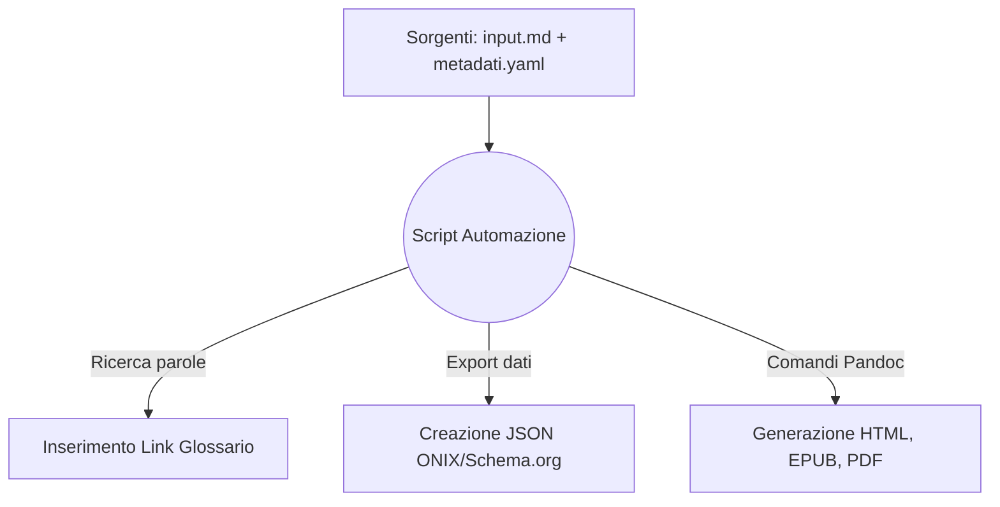

# One Health & Futuro Digitale: Dossier Strategico
## Analisi multidisciplinare su Salute, Clima, IA e Disinformazione per i professionisti dell'informazione

## Introduzione

Il presente documento illustra l'ideazione, l'analisi e lo sviluppo pratico di un flusso editoriale automatizzato per la pubblicazione digitale. Lo scopo principale del progetto è la creazione di un "Dossier Strategico" incentrato su tematiche scientifiche di attualità, pensato per rispondere alle esigenze di giornalisti, redattori web e divulgatori che hanno bisogno di informazioni chiare e facilmente consultabili per il loro lavoro quotidiano.

L'infrastruttura è stata costruita seguendo il paradigma del *Single Source Publishing* (SSP). Attraverso uno script in linguaggio Python, un unico file di testo sorgente scritto in formato Markdown viene elaborato per generare in modo del tutto automatico tre formati finali: un sito web statico (Web-Book in HTML), un e-book in formato EPUB e un documento PDF ottimizzato per la stampa. L'automazione si occupa inoltre di estrarre e compilare i metadati descrittivi dell'opera nei formati standard ONIX e Schema.org.

I codici sorgente, le istruzioni di conversione e le logiche di programmazione utilizzati per strutturare questa automazione sono esattamente quelli forniti dal docente e illustrati nei materiali didattici del corso. Tali componenti sono stati analizzati, riadattati e riassemblati per funzionare in sequenza logica all'interno di questo flusso di lavoro, dimostrando l'efficacia pratica degli strumenti presentati a lezione.

## Ideazione 

### Tema
Per il contenuto del dossier è stato scelto il concetto della "One Health", ovvero l'approccio che riconosce come la salute umana, la salute animale e la tutela dell'ambiente naturale costituiscano un unico sistema interconnesso. Si tratta di un tema molto discusso al giorno d'oggi, per il quale è essenziale un'informazione accurata e lontana da semplificazioni.

Il testo è stato suddiviso in sette capitoli che esplorano diverse aree scientifiche:
1. **Salute Globale:** L'impatto delle attività umane sugli ecosistemi e i fattori che favoriscono la diffusione delle zoonosi.
2. **Intelligenza Artificiale:** L'uso dei dati in medicina e i rischi legati ai pregiudizi (bias) degli algoritmi.
3. **Crisi Climatica:** Come la scienza valuta e attribuisce i singoli eventi meteorologici estremi.
4. **Agricoltura Sostenibile:** Le tecniche di coltivazione (come la semina diretta) che permettono di trattenere il carbonio nel suolo.
5. **Disinformazione:** Come si diffondono le notizie false e le strategie di difesa per i lettori.
6. **Transizione Energetica:** L'impatto dei materiali e il ciclo di vita (LCA) delle tecnologie pulite.
7. **Open Science:** L'importanza della trasparenza dei dati e dei server di preprint per la validità della ricerca.

### Destinatari
I destinatari del progetto sono stati definiti delineando due profili professionali (*personas*), inseriti in scenari d'uso specifici:

* **Il Redattore Web:** Lavora nelle redazioni dei giornali online con tempi di consegna molto stretti. Deve scrivere articoli di approfondimento su argomenti complessi senza avere una laurea scientifica.
  * *Scenario d'uso:* A seguito di un'emergenza ambientale, consulta il sito web del progetto per scrivere un articolo. Trova un'introduzione chiara al problema e le sintesi di studi autorevoli. Usando i link diretti, scarica i documenti originali ed esegue il fact-checking, concludendo l'articolo in tempo e citando fonti certe.
* **Il Divulgatore:** Crea contenuti per newsletter, blog o corsi di formazione. Cerca materiali affidabili e ben organizzati da studiare e rielaborare con cura in un secondo momento.
  * *Scenario d'uso:* Durante uno spostamento in treno, legge il dossier in modalità offline sul suo e-reader. Grazie al formato EPUB, naviga facilmente tra i capitoli. Incontrando un termine tecnico, clicca sul link e legge la spiegazione nel glossario finale senza perdere il segno. Decide poi di usare la struttura in capitoli come scaletta per la sua prossima newsletter.

### Requisiti di accettazione e Struttura delle cartelle
Per ritenere il prodotto editoriale valido e funzionante, sono stati soddisfatti i seguenti requisiti tecnici:
* **Separazione tra contenuto e stile:** Il file Markdown deve contenere solo il testo. Le indicazioni visive (colori, margini) devono essere escluse e gestite a parte tramite fogli di stile.
* **Adattabilità dell'e-book:** L'EPUB deve adattarsi a qualsiasi schermo e permettere la visualizzazione corretta della Modalità Notte.
* **Metadati standardizzati:** I file descrittivi del libro devono rispettare le specifiche JSON per essere letti correttamente dai motori di ricerca e dai cataloghi.

A livello organizzativo, il progetto è strutturato partendo da una cartella principale `Progetto_editoria`, che contiene direttamente i file generali come `README.md` (con le descrizioni) e il file `.gitignore` (utilizzato per escludere file temporanei o di sistema dal controllo di versione su GitHub). È stata inoltre introdotta una cartella `Docs` per separare la documentazione generale dalle sorgenti. Al suo interno si trovano l'immagine del logo di ateneo (`minerva.jpg`), il file delle linee guida d'esame (`Traccia d'esame.pdf`) e la sottocartella `Relazione` che ospita stabilmente questo documento testuale (`relazione.md`) e la sua versione compilata e impaginata (`relazione.pdf`).

## Processo di Produzione

### Acquisizione dei contenuti e ruolo dell'Intelligenza Artificiale
Gli articoli scientifici di partenza utilizzati per il dossier sono stati selezionati tramite database accademici in modalità Open Access. Lo studio delle fonti, l'ideazione della struttura dei capitoli e la redazione materiale dei testi in italiano sono stati svolti in modo del tutto autonomo, garantendo che il linguaggio fosse adatto ai destinatari scelti.

In questo lavoro, l'Intelligenza Artificiale (modello Gemini) è stata utilizzata in maniera consapevole e molto limitata, intervenendo solo su compiti specifici. Ha generato l'immagine utilizzata per la copertina e ha fornito un supporto al debugging per risolvere alcuni piccoli errori di sintassi durante la scrittura dello script in Python. Nessun contenuto, né l'architettura logica del progetto editoriale, è stato creato in automatico dall'IA.

### L'assemblaggio dei codici del corso
Il flusso di gestione documentale è governato dallo script orchestratore `main.py`, che mette in pratica e collega in automatico le tecnologie illustrate nei PDF didattici del corso:

1. **Gestione del Testo (Markdown):** Lo script analizza il file sorgente `input.md` (formattato secondo le regole di *LT2-FormatiMarcatura-MarkDown.pdf*). Una piccola funzione esamina il testo e inserisce automaticamente i collegamenti verso il glossario solo alla prima volta che una parola compare, evitando di dover inserire i link a mano e riducendo il rischio di dimenticanze.
2. **Estrazione dei Metadati:** I dati descrittivi inseriti nel file YAML vengono convertiti dallo script in file JSON (ONIX e Schema.org), applicando le spiegazioni viste in *LM4-FlussiLavoroEditoriale-Metadati.pdf*.
3. **Compilazione con Pandoc:** Lo script invoca il convertitore Pandoc utilizzando esattamente i comandi presentati in *LT6-TrasformazioniFormati-Pandoc.pdf*. Pandoc unisce il testo con i dati della bibliografia (`bibliografia.bib`), generando i formati finali con un unico comando.

### Scelte grafiche e di stile
L'aspetto visivo del progetto è stato mantenuto molto semplice, applicando in modo pratico le istruzioni del corso ed evitando inutili complicazioni grafiche:

* **Sito Web (HTML):** Seguendo i concetti di *LM6-WebBook.pdf*, si è scelto uno stile grafico essenziale per facilitare la lettura a schermo. Vengono usati sfondi chiari e testo scuro, con titoli colorati per staccare i paragrafi. Gli indici sono stati inseriti all'interno di semplici riquadri per rendere la navigazione ordinata.
* **E-book (EPUB):** In linea con le buone pratiche di *LM5-LibroElettronico.pdf* per i libri fluidi, dal foglio di stile per l'e-book sono stati rimossi i colori fissi. Ci sono solo le istruzioni di base per distanziare i paragrafi. Grazie a questa semplicità, il testo si adatta da solo al lettore: se l'utente mette la Modalità Notte, lo sfondo diventa nero e le lettere bianche, senza che si formino blocchi rettangolari illeggibili.
* **Documento per la stampa (PDF):** La creazione e l'impaginazione del documento PDF sono state delegate direttamente al motore LaTeX, come spiegato in *LT7-FormatiMarcatura-Latex.pdf*. Questo sistema si occupa di organizzare la pagina, calcolare i margini, allineare il testo e far andare a capo i capitoli, restituendo un layout formale e pulito.

## Valutazione dei risultati raggiunti

### Valutazione del flusso di produzione
L'introduzione della pipeline automatizzata basata sul Single Source Publishing (concetto approfondito in *LM3-ProcessoEditoriale.pdf*) ha evidenziato notevoli vantaggi:
* **Riduzione dei tempi:** L'intero processo di aggiornamento e generazione di tutti i formati richiede meno di tre secondi complessivi dall'avvio dello script.
* **Riduzione degli errori:** Mantenendo tutti i contenuti in un unico punto (`input.md`), non c'è il rischio di dimenticare una correzione su uno specifico formato (come spesso accade se si devono aggiornare a mano il PDF e poi la pagina web).
* **Affidabilità e Semplicità:** Aver riutilizzato e riadattato i codici forniti dal docente ha permesso di costruire un ambiente solido, che funziona bene e che è semplice da comprendere e da mantenere in futuro.

### Confronto con lo stato dell'arte
In un normale flusso di lavoro (ASIS), l'autore scrive su Word per fare il PDF, poi copia e incolla i testi in una piattaforma web per il sito, e infine usa un altro programma (come Calibre) per convertire il file in e-book. Un banale errore di battitura costringerebbe ad aprire tre programmi separati per fare la stessa identica correzione. 
Nel flusso qui proposto (TOBE), si lavora solo sul file in Markdown. Una volta salvato il documento, l'automazione riallinea simultaneamente tutti i formati, senza nessuno sforzo di copia-incolla manuale.

### Limiti emersi
Il sistema presenta alcune limitazioni. Questo flusso di lavoro richiede l'installazione sul computer di vari programmi (Python, Pandoc e la libreria LaTeX per il PDF). Inoltre, il PDF creato da LaTeX non riesce a leggere automaticamente le semplici istruzioni grafiche usate per i siti web; per questo motivo, è stato necessario inserire i comandi per i margini e l'aspetto della pagina stampata direttamente all'interno delle configurazioni YAML del documento sorgente.

## Conclusioni
Gli obiettivi del progetto sono stati raggiunti con successo. Il "Dossier Strategico" è uno strumento editoriale utile e accessibile da chiunque. Riadattare i codici spiegati a lezione si è rivelata una strategia vincente per comprendere e applicare concretamente l'automazione, eliminando le perdite di tempo legate all'impaginazione manuale. L'utilizzo limitato dell'Intelligenza Artificiale ha agevolato piccoli compiti tecnici e grafici, lasciando all'autore la totale paternità logica e testuale del lavoro. Come sviluppo futuro, si potrebbe pensare di integrare GitHub Actions per far sì che la generazione dei file avvenga direttamente online, rendendo il sistema utilizzabile anche su computer privi di questi programmi preinstallati.

## Bibliografia e sitografia

* Articoli scientifici Open Access recuperati dai database bibliografici e indicizzati nel file `bibliografia.bib`.
* Materiale didattico del corso di Editoria Digitale (Università degli Studi di Milano). I codici e le logiche utilizzati per l'automazione del progetto derivano dallo studio e dal riadattamento dei seguenti documenti del docente:
  * *LT2-FormatiMarcatura-MarkDown.pdf* (Per la sintassi testuale del sorgente).
  * *LM3-ProcessoEditoriale.pdf* (Per le logiche del Single Source Publishing e della multicanalità).
  * *LM4-FlussiLavoroEditoriale-Metadati.pdf* (Per la struttura YAML e l'estrazione in Schema.org e ONIX).
  * *LM5-LibroElettronico.pdf* (Per l'impostazione grafica e la fluidità dell'EPUB).
  * *LM6-WebBook.pdf* (Per l'impostazione e la navigazione del Web-Book).
  * *LT6-TrasformazioniFormati-Pandoc.pdf* (Per i comandi di compilazione e fusione dei file).
  * *LT7-FormatiMarcatura-Latex.pdf* (Per la gestione del PDF tramite il motore tipografico).