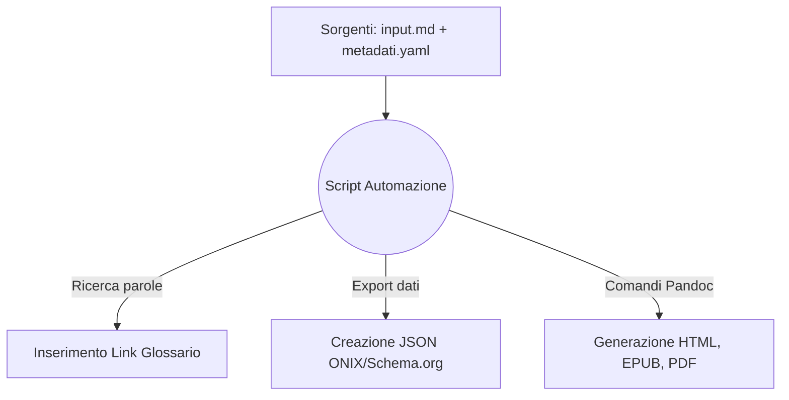

# One Health & Futuro Digitale: Dossier Strategico
Analisi multidisciplinare su Salute, Clima, IA e Disinformazione per i professionisti dell'informazione

## Introduzione

Il presente documento descrive l'ideazione e lo sviluppo di un flusso editoriale completamente automatizzato per la pubblicazione digitale. L'obiettivo del progetto è la creazione di un "Dossier Strategico" su tematiche scientifiche di grande attualità, pensato per fornire a giornalisti, redattori web e divulgatori informazioni chiare, verificate e facili da consultare nel loro lavoro quotidiano.

L'intero progetto si basa sul principio del *Single Source Publishing* (SSP). Questo significa che tutto il contenuto del dossier si trova in un unico file di testo scritto in formato Markdown, separato da qualsiasi logica grafica. Per far funzionare l'automazione, è stato sviluppato uno script in Python che elabora questo testo e guida il convertitore Pandoc. Avviando lo script, il sistema genera in automatico tre formati finali: un sito web statico (Web-Book in HTML), un e-book (EPUB) e un documento PDF pronto per la stampa. Allo stesso tempo, lo script estrae le informazioni descrittive sull'opera (i metadati) nei formati standard ONIX e Schema.org.

È importante sottolineare che i codici, i comandi di conversione e le logiche utilizzate per costruire questa automazione sono esattamente quelli forniti dal docente e illustrati nei materiali didattici del corso. Questi codici sono stati studiati, riadattati e riassemblati per funzionare in sequenza all'interno di questo specifico flusso di lavoro, dimostrando sul campo l'efficacia degli strumenti presentati a lezione.

## Ideazione 

### Tema
Per il contenuto del dossier è stato scelto il concetto di "One Health", ovvero l'approccio che riconosce che la salute umana, quella degli animali e l'ambiente naturale sono un unico grande sistema collegato. Si tratta di un argomento molto discusso oggi e con una forte attenzione mediatica, per il quale è fondamentale avere a disposizione un'informazione accurata e lontana dalle *fake news*.

Il testo è stato diviso in sette capitoli che esplorano diverse aree scientifiche:
1. **Salute Globale:** Come i danni agli ecosistemi favoriscono la diffusione di nuove malattie (zoonosi).
2. **Intelligenza Artificiale:** L'uso dei dati in medicina e il rischio legato ai pregiudizi (bias) degli algoritmi.
3. **Crisi Climatica:** Come la scienza riesce ad attribuire al cambiamento climatico i singoli eventi estremi.
4. **Agricoltura Sostenibile:** Tecniche di coltivazione, come la semina diretta, che aiutano a trattenere il carbonio nel suolo.
5. **Disinformazione:** Come si diffondono le notizie false e come difendersi preventivamente (prebunking).
6. **Transizione Energetica:** Qual è l'impatto reale e il ciclo di vita (LCA) delle tecnologie pulite.
7. **Open Science:** Perché condividere i dati liberamente è fondamentale per la validità della ricerca.

### Destinatari
Per calibrare il linguaggio da usare e l'organizzazione dei formati, sono stati definiti due profili professionali di riferimento (*personas*), inseriti in scenari d'uso specifici:

* **Il Redattore Web:** Lavora nella redazione di un giornale online, ha scadenze molto strette e deve scrivere articoli complessi pur non avendo una laurea in materie scientifiche.
  * *Scenario d'uso:* In caso di un'emergenza ambientale, deve scrivere un pezzo in fretta. Visita il sito web del progetto, legge un'introduzione chiara al problema e trova i riassunti di studi autorevoli. Usa i link nel testo per scaricare gratuitamente i documenti originali, verifica le informazioni e chiude l'articolo in tempo, citando fonti sicure.
* **Il Divulgatore:** Crea newsletter, blog o corsi di formazione. Cerca materiali ben organizzati da poter studiare con calma e rielaborare in futuro.
  * *Scenario d'uso:* Mentre viaggia in treno, legge il dossier offline sul suo e-reader. Grazie al formato EPUB, naviga agilmente tra i capitoli. Se incontra un termine tecnico, ci clicca sopra e legge la definizione nel glossario senza perdere il segno. Trovando la struttura molto chiara, decide di usarla come scaletta per la sua prossima newsletter.

### Requisiti di accettazione
Per considerare il progetto completo e funzionante, sono stati fissati e rispettati i seguenti requisiti:
* **Separazione tra testo e stile:** Il file Markdown sorgente deve contenere solo testo puro. Impostazioni grafiche come sfondi, colori e margini devono trovarsi esclusivamente nei file CSS esterni.
* **Adattabilità dell'e-book:** L'EPUB deve essere fluido. Deve adattarsi alle dimensioni dello schermo di chi legge e funzionare correttamente anche se l'utente attiva la "Modalità Notte".
* **Metadati standard:** I file JSON generati dallo script devono seguire le regole ufficiali per poter essere letti senza errori dai motori di ricerca e dai cataloghi librari.

### Canali di distribuzione
Il progetto è stato pensato per presidiare tre canali di distribuzione diversi, ognuno con uno stile visivo adeguato e formale:

1. **Canale Web (HTML):** Distribuito come sito statico. Lo stile (gestito dal file `style.css`) è pulito e simile a quello di un report aziendale o universitario. Sono stati usati sfondi chiari e testo scuro, racchiudendo gli indici in semplici riquadri per rendere la lettura comoda sia da PC che da telefono.
2. **Canale E-reader (EPUB):** Ottimizzato per dispositivi a inchiostro elettronico. Lo stile dell'e-book (`epub.css`) è molto essenziale. Sono stati tolti i colori fissi, lasciando solo le regole per distanziare i paragrafi, in modo che il testo si adatti in automatico anche in caso di inversione dei colori dello schermo.
3. **Canale Stampa (PDF):** Pensato per l'archiviazione e la stampa. L'impaginazione formale è stata lasciata al motore LaTeX, che crea in automatico un documento dall'aspetto accademico, con il testo giustificato e i margini speculari.

## Processo di Produzione

### Acquisizione dei contenuti
Gli articoli scientifici di base sono stati cercati sui database accademici online, scegliendo unicamente paper pubblicati con licenza Open Access. In questo modo, il "costo di acquisizione" economico delle fonti è stato nullo. 
Dato che l'impaginazione e la creazione della bibliografia avvengono in automatico grazie al software, il costo principale del progetto, in termini di tempo, è stato il lavoro di redazione manuale: i paper in inglese sono stati studiati e riassunti in un italiano chiaro e divulgativo all'interno del file sorgente `input.md`.

### Gestione documentale
Il motore che fa funzionare l'intero progetto è lo script `main.py`. Questo programma automatizza le fasi del flusso documentale in modo sequenziale:

1. **Raccolta:** Lo script carica il file di testo Markdown e i dati editoriali inseriti nel file YAML.
2. **Revisione automatica (Glossario):** Una funzione analizza il testo usando le espressioni regolari (RegEx). Cerca le parole chiave e inserisce da sola i link al glossario la prima volta che queste compaiono in un paragrafo. Questo evita di dover inserire i tag a mano.
3. **Generazione dei metadati:** Lo script preleva le informazioni dal file YAML e crea i file JSON con i metadati pronti per i distributori.
4. **Conversione e Produzione:** Infine, lo script avvia Pandoc per unire il testo pulito, la bibliografia e le immagini. In un solo colpo vengono generati l'HTML, l'EPUB e il PDF, associando a ciascuno il proprio foglio di stile.

### Tecnologie adottate
Le tecnologie scelte hanno un ruolo pratico nel soddisfare gli scenari d'uso dei destinatari:

| Tecnologia | Contributo per il Canale Web (Scenario 1) | Contributo per il Canale E-Book (Scenario 2) |
| --- | --- | --- |
| **Markdown** | Tradotto in tag HTML puliti per una lettura veloce da browser. | Offre una struttura modulare, perfetta per creare l'indice navigabile sull'e-reader. |
| **Python** | Automatizza il processo, copiando i file CSS nella cartella del sito senza errori. | Assicura che tutti i link al glossario siano inseriti in modo coerente e funzionante. |
| **Pandoc** | Traduce il file della bibliografia in note a piè di pagina perfette. | Esporta un file EPUB tecnicamente validato e pronto all'uso in mobilità. |

### Esecuzione del flusso
Il progetto, il codice sorgente, i materiali e la relativa documentazione sono pubblici e consultabili su GitHub. Per mantenere ordinato l'ambiente di lavoro, la struttura delle cartelle è stata organizzata in modo preciso:
* Nella cartella principale `Progetto_editoria` si trovano solo i file fondamentali di gestione: il `README.md` (che descrive brevemente il progetto) e il file `.gitignore`. Quest'ultimo è un file tecnico molto importante che serve a indicare a Git quali file o cartelle (come i file temporanei del sistema operativo) devono essere ignorati e non caricati online.
* È stata poi creata una cartella `Docs` per separare la documentazione generale dai codici sorgente. Al suo interno sono conservati l'immagine del logo di ateneo (`minerva.jpg`), il file delle direttive fornite dal docente (`Traccia d'esame.pdf`) e una sottocartella `Relazione` che contiene questo stesso testo in formato Markdown (`relazione.md`) e la sua versione già impaginata e compilata (`relazione.pdf`).

Per rieseguire l'intero processo di compilazione multicanale, è sufficiente avviare il file `main.py` posizionato all'interno della directory.

### Utilizzo di intelligenza artificiale generativa
In questo progetto, l'Intelligenza Artificiale (modello Gemini) è stata utilizzata in modo consapevole, limitato e non invasivo. Il suo intervento è stato richiesto solo per due compiti precisi di supporto: generare l'immagine usata per la copertina del dossier e fornire un aiuto per fare debugging (risolvere piccoli errori di sintassi) durante la stesura delle espressioni regolari in Python.
Ogni suggerimento dell'IA è stato testato e validato eseguendo il codice da terminale. L'uso dell'IA ha ridotto i tempi morti di programmazione, ma tutto il ragionamento logico, la stesura dei contenuti, l'organizzazione delle cartelle e l'assemblaggio dei codici sono frutto di un lavoro di progettazione completamente personale.

## Valutazione dei risultati raggiunti

### Valutazione del flusso di produzione
L'uso dell'automazione e del paradigma Single Source Publishing ha portato a risultati molto soddisfacenti:
* **(i) Riduzione dei tempi:** Una volta terminato di scrivere il testo, lo script impiega meno di tre secondi per generare contemporaneamente il sito web, il PDF e l'e-book.
* **(ii) Riduzione degli errori:** Poiché il testo risiede in un solo file (`input.md`), è impossibile correggere un refuso sul sito e dimenticarsi di farlo anche sul PDF.
* **(iii) Miglioramento della qualità:** Il testo sorgente in Markdown rimane sempre pulito e facile da leggere, privo di blocchi di codice grafico al suo interno.
* **(iv) Miglioramento dell'accettazione tecnologica:** Riadattare gli esempi di codice visti a lezione ha permesso di capire a fondo il processo, rendendo la scrittura dello script molto più sicura.
* **(v, vi) Nuovi canali e scenari:** È stato possibile creare file ottimizzati sia per la lettura veloce su schermo (Scenario 1) sia per la lettura approfondita su e-reader (Scenario 2).

### Confronto con lo stato dell'arte
Nel metodo di lavoro tradizionale (flusso ASIS), un autore scrive su Word per ottenere il PDF, poi copia e incolla gli stessi testi dentro una piattaforma web per il sito, e infine usa un altro software (come Calibre) per creare l'e-book. In caso di un errore di battitura, bisogna aprire tre programmi diversi e perdere tempo per sistemarli tutti. 
Nel flusso automatizzato implementato in questo progetto (TOBE), si lavora unicamente sul file in Markdown. Con un solo comando, l'automazione aggiorna simultaneamente tutti i formati senza alcun copia-incolla manuale.

### Limiti emersi
Il sistema presenta alcuni limiti tecnici. Per funzionare, questo flusso richiede l'installazione sul computer di programmi abbastanza pesanti, come Python, Pandoc e l'intera libreria LaTeX per la generazione dei PDF. 
Inoltre, si è riscontrato un limite nella separazione tra testo e grafica: il file PDF creato da LaTeX non è in grado di leggere e interpretare i normali file CSS usati per le pagine web. Di conseguenza, le istruzioni sui margini e sull'aspetto del testo stampato sono state inserite all'inizio del file sorgente (nel blocco YAML), creando una parziale eccezione alla regola della separazione totale degli stili.

## Conclusioni
Gli obiettivi posti in fase di ideazione sono stati pienamente raggiunti. Il "Dossier Strategico" è uno strumento editoriale pratico, che risponde bene alle necessità delle *personas* individuate. L'approccio adottato elimina totalmente il peso e le inefficienze dell'impaginazione manuale dei documenti. Lo studio e il riadattamento dei codici forniti dal docente si sono rivelati fondamentali per costruire un sistema stabile e funzionante. In futuro, sarebbe interessante integrare questo script su server remoti (usando GitHub Actions), in modo che la generazione automatica dei file avvenga direttamente online, rendendo il sistema utilizzabile anche su computer privi dei software necessari preinstallati.

## Bibliografia e sitografia

* Articoli scientifici Open Access recuperati dai database bibliografici e indicizzati all'interno del file `bibliografia.bib`.
* Materiale didattico del corso di Editoria Digitale (Università degli Studi di Milano). I codici e le logiche utilizzati per l'automazione di questo progetto derivano dallo studio, dal riadattamento e dall'assemblaggio dei seguenti documenti ufficiali forniti dal docente:
  * *LT2-FormatiMarcatura-MarkDown.pdf*
  * *LM3-ProcessoEditoriale.pdf*
  * *LM4-FlussiLavoroEditoriale-Metadati.pdf*
  * *LM5-LibroElettronico.pdf*
  * *LM6-WebBook.pdf*
  * *LT6-TrasformazioniFormati-Pandoc.pdf*
  * *LT7-FormatiMarcatura-Latex.pdf*