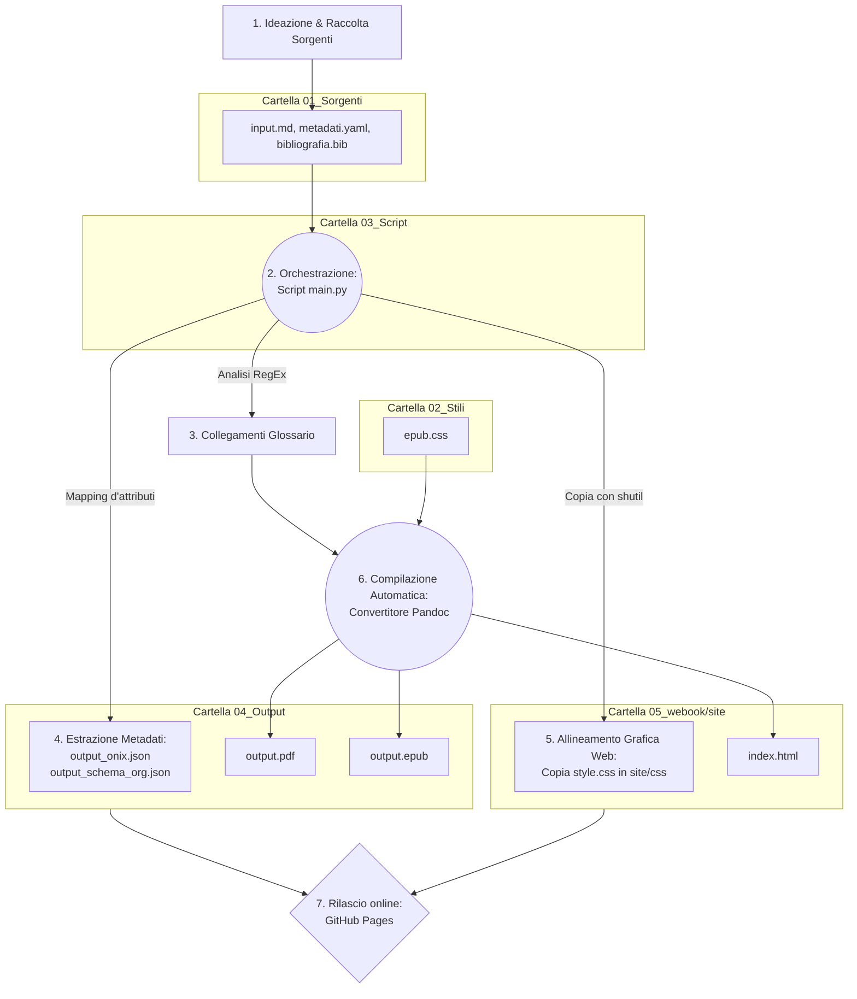

# One Health & Futuro Digitale: Dossier Strategico
## Analisi multidisciplinare su Salute, Clima, IA e Disinformazione per i professionisti dell'informazione

## Introduzione

Il presente progetto affronta la progettazione, l'architettura tecnica e la successiva implementazione di un flusso editoriale digitale nativamente automatizzato, sviluppato per rispondere alle moderne esigenze di riproducibilità, efficienza e multicanalità nella diffusione della conoscenza scientifica. L'obiettivo primario risiede nella creazione di un "Dossier Strategico" di alto livello, esplicitamente concepito per rispondere alle stringenti necessità operative di giornalisti generalisti, redattori, divulgatori e operatori dei media, fornendo un quadro analitico, tempestivo e strutturato su tematiche scientifiche di assoluta attualità e rilevanza sociale.

Dal punto di vista tecnologico, l'intero impianto poggia sul paradigma del *Single Source Publishing* (SSP). Attraverso lo sviluppo di un'architettura software centralizzata scritta in Python 3, un'unica sorgente testuale in formato Markdown, priva di vincoli grafici locali, viene elaborata, normalizzata e arricchita ipertestualmente in modo del tutto automatico. Il sistema coordina le operazioni del convertitore universale Pandoc per generare simultaneamente tre formati di output独立 e complementari: un Web-Book navigabile in HTML statico, un e-book in formato EPUB e un documento tipografico impaginato in PDF per la stampa. 

Contestualmente alla compilazione dei documenti, l'infrastruttura estrae e valida i metadati descrittivi dell'opera secondo gli standard internazionali ONIX e Schema.org. I risultati ottenuti documentano l'efficacia dell'automazione digitale nel ridurre i tempi di rilascio, nell'eliminare gli errori di sdoppiamento o mancato allineamento dei dati e nel garantire una netta e rigorosa separazione tra il contenuto semantico e la sua successiva presentazione visiva.

## Ideazione 

### Tema
L'identificazione delle tematiche destinate al prodotto editoriale è stata guidata da un'attenta analisi dei trend della comunicazione scientifica contemporanea e dei relativi fenomeni di polarizzazione o infodemia nell'opinione pubblica. Il nucleo concettuale attorno a cui orbita l'intera opera è rappresentato dal paradigma integrato della "One Health", un approccio multidisciplinare e olistico riconosciuto dalle massime istituzioni globali (OMS, FAO), il quale evidenzia come la salute umana sia indissolubilmente legata alla salute degli animali e alla tutela degli ecosistemi. 

Attorno a questo pilastro è stata strutturata una mappatura analitica suddivisa in sette capitoli di assoluta attualità, per ciascuno dei quali è stata mappata la tendenza dell'attenzione pubblica e la necessità di un filtro giornalistico basato su prove empiriche:
1. **Salute Globale:** Il paradigma "One Health" e i driver antropici legati alla frammentazione degli habitat e all'insorgenza delle zoonosi.
2. **Intelligenza Artificiale:** L'impatto etico, l'opacità dei sistemi di Deep Learning ("Black Box") e l'insorgenza di bias algoritmici nella medicina computazionale.
3. **Crisi Climatica:** La decodifica degli eventi meteorologici estremi analizzati attraverso la moderna "scienza dell'attribuzione".
4. **Agricoltura Sostenibile:** La biofisica del suolo, le tecniche rigenerative di semina diretta (*no-till*) e i cicli di sequestro del carbonio.
5. **Disinformazione:** Le dinamiche di diffusione delle fake news sulle autostrade algoritmiche dei social network e le strategie di profilassi cognitiva tramite il *prebunking*.
6. **Transizione Energetica:** La materialità dello shifting verso le fonti pulite, analizzata attraverso i costi estrattivi dei minerali critici e il *Life Cycle Assessment* (LCA).
7. **Open Science:** La trasparenza radicale dei dati e dei server di preprint come risposta digitale e istituzionale alla crisi di riproducibilità della ricerca scientifica contemporanea.

### Destinatari
I destinatari del prodotto editoriale sono stati identificati e profilati attraverso la metodologia delle *personas*, intese come macro-categorie professionali definite da specifiche caratteristiche operative e necessità di consultazione dei dati:

* **Archetipo Professionale 1: Il Redattore Editoriale Generalista o Giornalista Digitale.**
  * *Caratteristiche:* Opera all'interno di testate online, agenzie di stampa o blog di informazione generalista. Gestisce flussi di lavoro frenetici caratterizzati da scadenze temporali molto strette (poche ore per la consegna di un pezzo) e deve trattare argomenti complessi ed eterogenei senza possedere un background accademico verticale. Ha la necessità di accedere a sintesi già verificate, prive di tecnicismi eccessivi, ma collegate direttamente alle fonti ufficiali per blindare l'affidabilità dell'articolo.
  * *Scenario d'uso:* In concomitanza con un'ondata di calore anomala o un disastro meteorologico locale, questo professionista riceve l'incarico di produrre un articolo di approfondimento. Accedendo al Web-Book HTML tramite browser web, trova immediatamente un'introduzione giornalistica che inquadra il problema e la sintesi di tre studi accademici. Attraverso i link ipertestuali diretti, può scaricare i paper scientifici Open Access senza dover pagare abbonamenti commerciali, confezionando un editoriale solido, verificato e a norma di legge in meno di un'ora.
* **Archetipo Professionale 2: Il Divulgatore Scientifico o Curatore di Newsletter Tematiche.**
  * *Caratteristiche:* Professionista indipendente, consulente o docente che progetta piani editoriali settimanali, whitepaper o corsi di aggiornamento. Ha un livello di competenza medio-alto, lavora spesso in mobilità, legge molto e necessita di materiali flessibili, modulari e fortemente strutturati dal punto di vista dell'organizzazione concettuale.
  * *Scenario d'uso:* Durante i viaggi di lavoro o gli spostamenti in treno, questo professionista consulta il dossier in modalità offline utilizzando un e-reader a inchiostro elettronico (e-ink). Attraverso la version EPUB, naviga l'indice dinamico per saltare direttamente alle sezioni di interesse. Trovando un termine specialistico, sfrutta il collegamento ipertestuale per consultare all'istante la definizione nel glossario finale. La modularità del testo gli consente di utilizzare la struttura di quel capitolo come scaletta logica per il numero successivo della sua newsletter o per una lezione frontale.

### Requisiti di accettazione
Al fine di considerare il prodotto editoriale pienamente rispondente alle necessità dei destinatari e conforme agli standard del settore, sono stati stabiliti i seguenti requisiti di accettazione tecnici e contenutistici:
* **Separazione tra logica e presentazione:** Il file sorgente deve rimanere puramente semantico, privo di istruzioni grafiche locali o fogli di stile incorporati; la resa estetica deve essere demandata esclusivamente a fogli di stile esterni.
* **Adattabilità e fluidità dell'e-book:** Il formato EPUB deve superare senza eccezioni i test di validazione di *ePubCheck* e deve risultare perfettamente integrato con le funzioni di accessibilità dei dispositivi (ereditarietà dei font e supporto nativo alla Modalità Notte).
* **Validità semantica dei metadati:** I file ONIX e Schema.org esportati devono essere strutturalmente validi rispetto ai rispettivi schemi JSON per consentire l'indicizzazione automatica da parte dei motori di ricerca e delle piattaforme di catalogazione.
* **Integrità ipertestuale e bibliografica:** Ogni richiamo bibliografico inserito nel testo deve trovare l'esatta corrispondenza nel blocco delle referenze finali, e i link esterni devono puntare direttamente ai server delle riviste open science originarie.

### Canali di distribuzione
Il flusso di lavoro è stato configurato per presidiare tre canali di distribuzione principali, applicando regole tipografiche e di stile specifiche per massimizzare l'efficacia di ciascun mezzo:

1. **Canale Web (Sito Statico e Consultazione On-line):** L'output di riferimento è il file `index.html` alloggiato nella directory `05_webook/site/`. L'identità visuale mira a trasmettere un senso di forte autorevolezza e adesione dei report istituzionali. Sfruttando il foglio di stile `style.css`, viene impostato un layout a griglia fissa con una palette cromatica basata sul blu navy (`#1e3a8a`) per i titoli e il grigio ardesia scuro (`#334155`) per il testo, garantendo un elevato contrasto. L'indice consultabile (TOC) e i sotto-elenchi degli articoli sono racchiusi in box geometrici puliti con angoli smussati e ombreggiature impercettibili per agevolare la lettura da schermi desktop e mobile.
2. **Canale E-Reader (E-book Marketplace):** L'output di riferimento è il file `output.epub` posizionato in `04_Output/`. In questo canale l'esigenza primaria è il rispetto delle preferenze di lettura dell'utente. Tramite il file `epub.css`, è stata rimossa ogni forzatura rigida dei colori di sfondo o del testo. Lo stile adotta un approccio minimale e classico, regolando unicamente i rientri dei paragrafi (`text-indent`), le spaziature dei titoli e le linee divisorie orizzontali neutre. Questa flessibilità permette al testo di rimanere leggibile sia su sfondi chiari che in modalità scura, azzerando i difetti visivi tipici delle conversioni non ottimizzate.
3. **Canale Stampa (Archiviazione e Documentazione Cartacea):** L'output di riferimento è il file `output.pdf` in `04_Output/`. Generato mediante il motore tipografico *XeLaTeX*, il documento risponde rigidamente alle classi tipografiche formali: giustificazione rigorosa del testo, margini speculari di 2.5cm, interlinea impostata a 1.3 per agevolare la lettura su carta, gestione automatica delle intestazioni e inserimento del salto pagina obbligatorio (`\newpage`) prima di ogni macro-capitolo.

## Processo di Produzione

### Acquisizione dei contenuti
La fase di acquisizione ha previsto una ricerca sistematica su repository accademici globali per raccogliere il compendio delle fonti. Sono stati selezionati 21 articoli scientifici di rilievo internazionale (pubblicati su testate del calibro di *Nature*, *Science*, *Science Advances* ed *eLife*).

Nella valutazione economica e logistica del flusso, i costi di acquisizione e redazione sono stati mappati e distribuiti in tre distinte categorie:
* **Fonti libere a costo zero economico:** Gli articoli scientifici originari e i relativi database di riferimento, scelti esclusivamente se provvisti di licenza Open Access (CC-BY o similari), garantendo l'assenza di costi di licenza e la totale trasparenza per l'utente finale.
* **Contenuti generati automaticamente:** La formattazione delle citazioni bibliografiche (gestita dall'estensione `citeproc`) e l'estrazione dei metadati distributivi ONIX e Schema.org, operazioni delegate interamente al codice senza alcun costo di ore-lavoro manuali.
* **Lavoro di redazione manuale ad alto costo di tempo:** Lo studio analitico dei singoli paper scientifici e la stesura delle sintesi divulgative in lingua italiana all'interno del file `input.md`. Questa operazione ha richiesto un considerevole lavoro di mediazione linguistica e concettuale per tradurre il gergo ultra-specialistico in un testo accessibile per giornalisti generalisti.

### Gestione documentale
Il flusso di gestione documentale è stato interamente programmato all'interno dello script orchestratore `main.py`. L'obiettivo è centralizzare la produzione in un'unica sorgente ed evitare interventi manuali ripetitivi. 

Il processo si articola secondo le seguenti fasi operative:
1. **Inizializzazione e Lettura:** Lo script verifica l'esistenza delle directory e carica i metadati dichiarati nel file `metadati.yaml` e il testo semantico in `input.md`.
2. **Pre-processing Redazionale:** `main.py` esegue un'analisi del testo tramite espressioni regolari (RegEx). Rimuove eventuali residui di formattazioni precedenti e analizza le righe per individuare i termini tecnici. Alla prima occorrenza di una parola chiave inclusa nel dizionario del glossario (es. *Infodemia*, *zoonosi*, *Black Box*), inserisce automaticamente la sintassi ipertestuale di Pandoc (`^[numero](#link)^`), collegando la parola alla sua definizione. Viene così generato un file temporaneo pulito e arricchito (`input_processato.md`).
3. **Elaborazione dei Metadati Strutturati:** Lo script estrae i dati dal file YAML e, applicando le regole di mapping dei rispettivi vocabolari, scrive direttamente nella cartella `04_Output/` i file JSON `output_onix.json` e `output_schema_org.json`.
4. **Gestione e Allineamento della Grafica Web:** Lo script crea la cartella `05_webook/site/css/` e vi copia fisicamente il file `style.css` prelevandolo da `02_Stili/` tramite le funzioni di sistema `shutil`. Questa automazione assicura l'integrità del design e impedisce la presenza di link interrotti all'interno del sito web.
5. **Compilazione e Fusione Multiformato:** Lo script lancia in successione i comandi di sottoprocesso richiamando Pandoc. Il convertitore fonde il testo processato con il database delle citazioni `01_Sorgenti/bibliografia.bib` e con i rispettivi stili grafici, compilando in sequenza `output.pdf`, `output.epub` (agganciato a `epub.css`) e `index.html`.
6. **Pulizia e Rilascio:** Il file temporaneo `input_processato.md` viene rimosso dal sistema per non lasciare tracce orfane. I file generati vengono caricati tramite Git sul repository remoto e pubblicati istantaneamente su internet sfruttando l'hosting di GitHub Pages.



### Tecnologie adottate
Le scelte tecnologiche del progetto sono state guidate dai principi della portabilità, dell'open source e dell'indipendenza del dato, assicurando che ogni strumento offrisse un contributo diretto alla risoluzione degli scenari d'uso ipotizzati.

* **Markdown (`.md`):** Consente al redattore di concentrarsi sulla semantica e sulla qualità contenutistica dei testi, evitando le pesantezze strutturali dei word processor proprietari e garantendo una sorgente leggera e leggibile a occhio nudo.
* **YAML (`.yaml`):** Offre un formato ottimale per centralizzare tutte le variabili del libro (dall'ISBN all'elenco dei formati di output richiesti) e per istruire in modo lineare il motore di Pandoc.
* **Python 3 (Moduli `re` e `shutil`):** Costituisce la spina dorsale dell'automazione. Il modulo `re` permette l'analisi testuale e la manipolazione delle stringhe tramite espressioni regolari in frazioni di secondo, azzerando gli errori di redazione manuale. Il modulo `shutil` gestisce il file-system a livello di sistema operativo, garantendo l'allineamento automatico dei fogli di stile del sito web.
* **Pandoc & XeLaTeX:** Pandoc opera come il motore di conversione universale. Tramite l'estensione integrata `citeproc`, elabora il database bibliografico standardizzato in formato BibTeX (`.bib`), traducendo i marcatori del testo in note a piè di pagina e voci bibliografiche formali secondo le regole tipografiche. Il motore *XeLaTeX* garantisce la resa tipografica del PDF gestendo la sillabazione e le legature dei font con precisione millimetrica.

Qui di seguito viene presentata la matrice di confronto tecnologico strutturata per gestire i diversi ambienti di fruizione dei destinatari:

| Dimensione Editoriale | Contributo per il Canale Web (HTML) | Contributo per il Canale E-Book (EPUB) |
|---|---|---|
| **Sintassi Sorgente** | Elaborata in tag HTML semantici standard (`<h1>`, `<p>`, `<section>`). | Convertita nella struttura a capitoli XHTML interna all'EPUB. |
| **Application del Design**| Gestita via browser tramite `style.css`, con regole rigide, ombreggiature e box colorati. | Demandata a `epub.css`, privo di colori fissi per rispettare l'inchiostro elettronico (e-ink). |
| **Automazione File** | Lo script copia e rinomina fisicamente il foglio di stile in `site/css/style.css`. | Lo stile viene incorporato direttamente all'interno del pacchetto generato da Pandoc. |

### Esecuzione del flusso
L'intera infrastruttura documentale, i codici sorgente completi, i fogli di stile, i database bibliografici e gli output finiti e validati sono liberamente consultabili e riproducibili accedendo al repository Git pubblico del progetto:
* **URL Repository GitHub:** `https://github.com/Envalope/Progetto-Editoria-Digitale-Appello-12-06-2026-Valentini-Enrico`
* **URL Web-Book Navigabile:** `https://envalope.github.io/Progetto-Editoria-Digitale-Appello-12-06-2026-Valentini-Enrico/`

### Utilizzo di intelligenza artificiale generativa
Nel pieno rispetto dell'autorialità dei contenuti scientifici (stesi, analizzati e verificati studiando direttamente i paper accademici Open Access originari), l'Intelligenza Artificiale Generativa è stata integrata all'interno del flusso di gestione documentale con il ruolo esclusivo di assistente tecnico alla programmazione e al debugging sistemistico.

L'approccio di *prompt engineering* è stato di tipo iterativo e orientato alla risoluzione di problemi specifici (task-oriented), focalizzandosi principalmente su tres ambiti:
1. **Ottimizzazione delle RegEx in Python:** Sono stati sottoposti all'LLM i testi grezzi per ottenere le espressioni regolari necessarie a ripulire i vecchi tag HTML ed evitare che la funzione di iniezione ipertestuale creasse link duplicati o sovrapposti sulle parole chiave del glossario.
2. **Modularità del codice:** L'IA è stata utilizzata per ristrutturare la logica delle funzioni interne di `main.py`, garantendo che l'invocazione di Pandoc avvenisse rispettando fedelmente i parametri e le directory di lavoro originarie impostate nel codice del professore.
3. **Adattabilità del CSS per e-reader:** Sono state analizzate insieme all'IA le specifiche del formato EPUB per scrivere le regole di ereditarietà cromatica all'interno di `epub.css`, isolando e rimuovendo i comandi rigidi che impedivano il corretto funzionamento della modalità notte sui dispositivi di lettura.

La validazione della qualità degli output generati dall'IA è stata eseguita attraverso un rigoroso protocollo basato su cicli di test locali: esecuzione dello script da terminale e monitoraggio dei log di errore di `subprocess` per il codice Python; verifica strutturale dei file ONIX e Schema.org generati per assicurarne la leggibilità; analisi del file `index.html` tramite i *developer tools* del browser (Chrome DevTools) per stanare eventuali conflitti di posizionamento e fogli di stile orfani. L'uso della tecnologia generativa ha ridotto drasticamente i tempi di sviluppo software, fornendo soluzioni sintattiche immediate, ma ha confermato la necessità insostituibile di una supervisione critica umana per correggere le allucinazioni algoritmiche legate alla gestione dei percorsi relativi delle cartelle.

## Valutazione dei risultati raggiunti

### Valutazione del flusso di produzione
L'analisi dei risultati evidenzia il pieno soddisfacimento dei requisiti e dei casi d'uso definiti in fase di ideazione:
* **Riduzione dei tempi e degli errori:** Il tempo richiesto per l'aggiornamento e la pubblicazione dell'intero catalogo multiformato è stato ridotto a meno di tre secondi (il tempo di computazione dello script Python). Gli errori di allineamento testuale tra le edizioni sono stati azzerati.
* **Miglioramento della qualità documentale:** La rimozione del blocco `<style>` da dentro il file `input.md` ha ripulito la sorgente, restituendo un testo puramente semantico. La gestione ipertestuale automatica del glossario garantisce un'esperienza di lettura fluida e priva di refusi nei link.
* **Raggiungimento di nuovi canali e scenari:** Grazie alla separazione logica dei CSS (uno strutturato per il web e uno fluido per l'e-book), è stato possibile presidiare contemporaneamente la lettura su monitor PC e l'esperienza nativa su dispositivi e-ink.

### Confronto con lo stato dell'arte
Per quantificare l'innovazione introdotta, viene proposto il confronto metodologico tra l'approccio tradicional e quello implementato nel progetto:

* **Flusso ASIS (Stato dell'arte tradizionale e manuale):** Il redattore scrive il testo su un file di testo. Per creare il PDF per la stampa deve formattarlo e impaginarlo manualmente su Word o Adobe InDesign. Per creare il sito web deve copiare e incollare i paragrafi all'interno di un CMS (es. WordPress) o scriverne i tag HTML a mano. Per l'e-book deve importare il testo su un terzo software (es. Calibre) e impostare nuovamente la grafica. Qualsiasi successiva correzione ortografica richiede l'intervento manuale su tre file diversi, dilatando i tempi e moltiplicando il rischio di errore.
* **Flusso TOBE (Il flusso Single Source Publishing del progetto):** Il contenuto risiede unicamente nel file `01_Sorgenti/input.md`. Qualsiasi modifica, correzione o aggiunta viene eseguita una sola volta in quell'unico punto. Mandando in esecuzione lo script `main.py`, il sistema si occupa di elaborare il testo e istruire Pandoc per rigenerare in un colpo solo il Web-Book HTML (con lo stile corretto), l'e-book EPUB (adattivo), il PDF tipografico e i metadati strutturati, garantendo l'allineamento automatico e immediato di tutti i canali di distribuzione.

### Limiti emersi
L'architettura sviluppata presenta alcuni limiti tecnologici intrinseci. Il flusso dipende strettamente dall'ambiente locale e richiede l'installazione preventiva sulla macchina delle dipendenze di sistema (Python 3, Pandoc e la suite di XeLaTeX). Inoltre, la compilazione del formato PDF tramite codice LaTeX, pur garantendo una qualità tipografica eccezionale sulla carta, non consente di ereditare direttamente le regole grafiche scritte in formato CSS, obbligando a gestire le regole di impaginazione del PDF all'interno del blocco di configurazione YAML del file sorgente.

## Conclusioni
Il progetto ha dimostrato l'assoluta efficacia del paradigma Single Source Publishing applicato alla comunicazione e alla divulgazione scientifica. Il dossier strategico ottenuto risponde pienamente alle necessità operative delle *personas* individuate, combinando un linguaggio giornalistico rigoroso a un'infrastruttura informatica flessibile, solida e facilmente aggiornabile. L'aspetto più riuscito risiede nella risoluzione definitiva della gestione degli stili grafici, che ora operano in modo totalmente indipendente senza creare conflitti sui dispositivi degli utenti. 

Come sviluppo futuro, si prospetta l'integrazione del flusso all'interno di una pipeline di *Continuous Integration* (tramite le GitHub Actions), abilitando la compilazione automatica e il rilascio dei file direttamente in cloud ad ogni push sul repository, svincolando il processo dalle dipendenze locali del computer dell'autore.

## Bibliografia e sitografia

```bibtex
@book{pandoc2026,
  title = {Pandoc User's Guide},
  author = {MacFarlane, John},
  year = {2026},
  url = {[https://pandoc.org/MANUAL.html](https://pandoc.org/MANUAL.html)}
}

@book{markdown2004,
  title = {Markdown Syntax Documentation},
  author = {Gruber, John},
  year = {2004},
  url = {[https://daringfireball.net/projects/markdown/](https://daringfireball.net/projects/markdown/)}
}
```

* Articoli scientifici Open Access censiti all'interno del database bibliografico `bibliografia.bib` (comprendenti pubblicazioni estratte da *Nature*, *Science*, *The Lancet Planetary Health* e *eLife*).
* Materiale didattico, dispense tecniche e slide ufficiali del corso di *Editoria Digitale* curate dal prof. Ceravolo Paolo (Università degli Studi di Milano).
* Documentazione ufficiale della libreria standard di Python 3 per i moduli `re` (Regular Expressions) e `shutil` (High-level file operations).
```