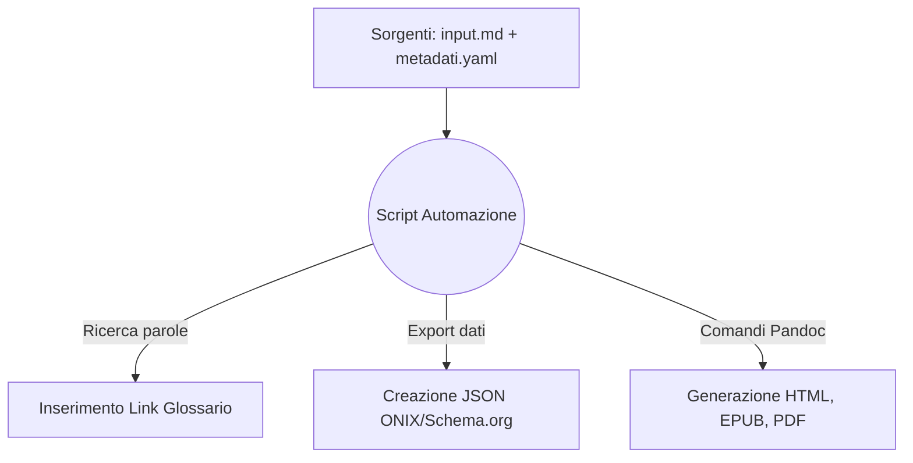

# One Health & Futuro Digitale: Dossier Strategico
## Analisi multidisciplinare su Salute, Clima, IA e Disinformazione per i professionisti dell'informazione

## Introduzione

Il presente documento illustra l'ideazione e lo sviluppo pratico di un flusso editoriale automatizzato. Lo scopo del progetto è la creazione di un "Dossier Strategico" incentrato su tematiche scientifiche attuali, pensato per rispondere alle esigenze di giornalisti, redattori e divulgatori che necessitano di informazioni chiare, verificate e facilmente consultabili.

L'infrastruttura è stata costruita seguendo il paradigma del *Single Source Publishing* (SSP). Attraverso uno script in linguaggio Python, un unico file di testo scritto in Markdown viene elaborato per generare in automatico tre formati finali: un sito web statico (Web-Book in HTML), un e-book in formato EPUB e un documento PDF per la stampa. L'automazione si occupa anche di estrarre in autonomia i metadati descrittivi del libro nei formati ONIX e Schema.org. 

È importante sottolineare che i codici, le istruzioni di conversione e le logiche utilizzate per costruire questa automazione sono esattamente quelli illustrati dal docente nei materiali del corso. Questi snippet di codice sono stati studiati, riadattati e riassemblati per funzionare in sequenza all'interno di questo specifico flusso di lavoro, dimostrando l'efficacia pratica degli strumenti presentati a lezione.

## Ideazione 

### Tema
Per il contenuto del dossier è stato scelto il concetto di "One Health", ovvero la consapevolezza che la salute umana, quella animale e l'ambiente naturale costituiscono un unico sistema interconnesso. Si tratta di un tema molto dibattuto, per il quale è richiesta un'informazione precisa e lontana da facili sensazionalismi.

Il testo è stato strutturato in sette capitoli:
1. **Salute Globale:** Il legame tra la frammentazione degli ecosistemi e la diffusione delle zoonosi.
2. **Intelligenza Artificiale:** L'uso dei dati in medicina e il rischio legato ai pregiudizi degli algoritmi.
3. **Crisi Climatica:** Come la scienza valuta e attribuisce i singoli eventi meteorologici estremi.
4. **Agricoltura Sostenibile:** Le tecniche di coltivazione che permettono di trattenere il carbonio nel suolo.
5. **Disinformazione:** Le dinamiche di diffusione delle notizie false e le strategie di difesa.
6. **Transizione Energetica:** L'impatto reale e il ciclo di vita delle tecnologie rinnovabili.
7. **Open Science:** L'importanza di condividere i dati per garantire la trasparenza della ricerca scientifica.

### Destinatari e Scenari d'Uso
I destinatari del progetto sono stati definiti delineando due profili professionali specifici (personas):

* **Il Redattore Web:** Lavora nelle redazioni dei giornali online. Ha tempi di consegna stretti e deve scrivere di argomenti complessi senza avere una laurea scientifica. 
  * *Scenario:* A seguito di un'emergenza ambientale, deve scrivere un pezzo di approfondimento. Consulta il sito web del progetto, legge un'introduzione chiara al problema e trova le sintesi di studi autorevoli. Utilizzando i link diretti, scarica i documenti originali gratuiti e conclude l'articolo in tempo, citando fonti certe.
* **Il Divulgatore:** Crea contenuti per newsletter, blog o corsi. Cerca materiali ben organizzati da studiare e rielaborare.
  * *Scenario:* Durante un viaggio, legge il dossier offline sul suo e-reader. Grazie al formato EPUB, naviga facilmente tra i capitoli. Incontrando un termine tecnico, clicca sul link e legge la definizione nel glossario. Trova la suddivisione in capitoli molto logica e decide di usarla come scaletta per il suo prossimo progetto divulgativo.

### Requisiti di accettazione e Struttura del Progetto
Per ritenere il progetto valido, sono stati fissati i seguenti requisiti:
* **Separazione tra testo e grafica:** Il file Markdown deve contenere solo il testo puro. Le istruzioni su come visualizzare il documento sono gestite esternamente.
* **Adattabilità dell'e-book:** L'EPUB deve adattarsi a qualsiasi schermo e preferenza dell'utente senza rompersi.
* **Metadati standard:** I file con i dati del libro devono rispettare le regole per essere letti dai motori di ricerca.

A livello organizzativo, l'intero progetto risiede nella cartella principale `Progetto_editoria`. Si segnala una specifica modifica strutturale: questa relazione e l'immagine del logo dell'Ateneo (`minerva.jpg`) sono state inserite all'interno di una sottocartella dedicata chiamata `Docs`. Questa scelta è stata fatta per mantenere l'ambiente di lavoro pulito, separando la documentazione descrittiva dai file sorgente e dai codici di automazione.

## Processo di Produzione

### Acquisizione dei contenuti e ruolo dell'Intelligenza Artificiale
Gli articoli scientifici di partenza sono stati individuati tramite database accademici in modalità Open Access. L'intero processo di studio delle fonti, l'ideazione della struttura dei capitoli e la scrittura materiale dei testi in italiano sono frutto di lavoro completamente autonomo. 

L'Intelligenza Artificiale generativa (Gemini) è stata utilizzata in modo consapevole, circoscritto e assolutamente non massiccio. L'intervento dell'IA è stato richiesto esclusivamente per due aspetti di supporto: la generazione grafica dell'immagine di copertina del dossier e un limitato aiuto tecnico per scovare piccoli errori di sintassi durante la compilazione dello script Python. L'architettura del flusso e le logiche di trasformazione sono state realizzate studiando i documenti del corso, senza delegare all'IA il lavoro di progettazione editoriale.

### L'assemblaggio dei codici del corso
Il flusso di gestione documentale è governato dallo script `main.py`, che mette in pratica in modo sequenziale le tecnologie illustrate nei PDF didattici:

1. **Gestione del Testo (Markdown):** Lo script legge il file `input.md`, scritto rispettando la sintassi definita in *LT2-FormatiMarcatura-MarkDown.pdf*. Una funzione esamina il testo e inserisce automaticamente i collegamenti al glossario, facendo risparmiare tempo e riducendo gli errori manuali.
2. **Estrazione dei Metadati:** I dati descrittivi compilati nel file YAML vengono convertiti dallo script in file JSON standardizzati (ONIX e Schema.org), applicando i concetti organizzativi illustrati in *LM4-FlussiLavoroEditoriale-Metadati.pdf*.
3. **Compilazione con Pandoc:** Lo script invoca il convertitore Pandoc utilizzando gli esatti comandi e parametri presentati in *LT6-TrasformazioniFormati-Pandoc.pdf*. Pandoc unisce il testo testuale con i dati bibliografici, generando simultaneamente i formati finali.

### Scelte grafiche e di stile
L'aspetto visivo del progetto è stato mantenuto volutamente semplice e pulito, applicando in modo pratico le indicazioni del corso senza inutili complicazioni tecniche:

* **Sito Web (HTML):** Seguendo i principi di *LM6-WebBook.pdf*, si è scelto uno stile grafico essenziale, simile a quello di un normale documento testuale da leggere a schermo. Si sono utilizzati sfondi chiari e testo scuro, con titoli ben evidenti, per rendere la lettura riposante e il sito facile da navigare.
* **E-book (EPUB):** Applicando le buone pratiche di *LM5-LibroElettronico.pdf*, si è deciso di non inserire alcun colore fisso o sfondo particolare. Il foglio di stile dà solo istruzioni minime sullo spazio tra i paragrafi. Grazie a questa semplicità, se un lettore usa la "Modalità Notte" sul proprio e-reader, lo schermo diventerà nero e il testo bianco in modo del tutto automatico, senza fastidiosi blocchi illeggibili.
* **Documento per la stampa (PDF):** L'impaginazione del PDF è stata lasciata al motore tipografico LaTeX, come illustrato in *LT7-FormatiMarcatura-Latex.pdf*. Il sistema crea da solo un documento dall'aspetto professionale e ordinato, occupandosi di calcolare i margini corretti, di giustificare il testo e di gestire i salti di pagina prima dell'inizio di un nuovo capitolo.

## Valutazione dei risultati raggiunti

### Vantaggi del flusso proposto
* **Gestione rapida:** L'intero processo di generazione dei tre formati richiede pochissimi secondi dall'avvio dello script.
* **Riduzione degli errori:** Come evidenziato in *LM3-ProcessoEditoriale.pdf*, il grande vantaggio del Single Source Publishing è avere un solo file sorgente. Una correzione fatta sul testo in Markdown si applica automaticamente su tutti i formati finali.
* **Riproducibilità:** L'aver riassemblato in uno script i codici forniti dal docente ha creato un ambiente di lavoro solido e facile da mantenere.

### Confronto con il metodo tradizionale
In un flusso di lavoro classico (ASIS), per produrre gli stessi output bisognerebbe usare Word per il PDF, copiare i testi in una piattaforma web per il sito, e usare un ulteriore programma per l'e-book. Un banale errore di battitura costringerebbe ad aprire tre programmi separati per apportare la stessa correzione. 
Nel flusso qui implementato (TOBE), si lavora esclusivamente sul file sorgente. Salvato il documento, l'automazione riallinea simultaneamente tutti i canali di distribuzione.

### Limiti emersi
Il sistema presenta alcuni limiti tecnici. Il processo di compilazione richiede che il computer abbia installati software specifici (Python, Pandoc e LaTeX). In particolare, il formato PDF generato tramite LaTeX non legge le semplici istruzioni grafiche scritte nei file CSS usati per il web; questo obbliga a gestire l'aspetto della pagina stampata direttamente all'interno delle configurazioni del file sorgente, creando un piccolo compromesso rispetto alla totale separazione della grafica.

## Conclusioni
Gli obiettivi del progetto sono stati pienamente raggiunti. Il "Dossier Strategico" risulta essere uno strumento editoriale utile e accessibile su vari dispositivi. Riadattare i codici spiegati a lezione si è rivelata una strategia vincente per comprendere e applicare l'automazione, eliminando lo sforzo dell'impaginazione manuale. L'utilizzo mirato e limitato dell'Intelligenza Artificiale ha agevolato piccoli compiti tecnici e grafici, lasciando all'autore la totale paternità logica e testuale del lavoro. 

## Bibliografia e sitografia

* Articoli scientifici Open Access recuperati dai database e indicizzati nel file `bibliografia.bib`.
* Materiale didattico del corso di Editoria Digitale (Università degli Studi di Milano). I codici, le logiche e i comandi utilizzati per l'automazione del progetto derivano dallo studio e dal riadattamento dei seguenti documenti ufficiali del docente:
  * *LT2-FormatiMarcatura-MarkDown.pdf* (Per la sintassi testuale del sorgente).
  * *LM3-ProcessoEditoriale.pdf* (Per le logiche del Single Source Publishing).
  * *LM4-FlussiLavoroEditoriale-Metadati.pdf* (Per la struttura YAML e l'estrazione in Schema.org e ONIX).
  * *LM5-LibroElettronico.pdf* (Per l'impostazione grafica fluida dell'EPUB).
  * *LM6-WebBook.pdf* (Per lo stile e l'impostazione del Web-Book).
  * *LT6-TrasformazioniFormati-Pandoc.pdf* (Per i comandi di compilazione e fusione dei file).
  * *LT7-FormatiMarcatura-Latex.pdf* (Per la gestione tipografica del formato cartaceo).