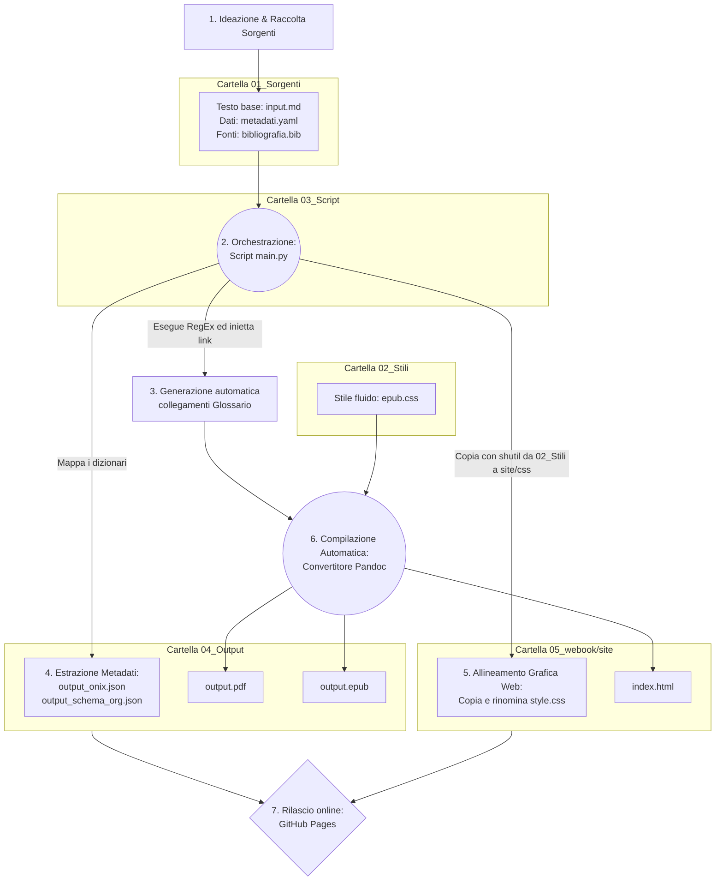

{width=100px height=100px}

# One Health & Futuro Digitale: Dossier Strategico
Analisi multidisciplinare su Salute, Clima, IA e Disinformazione per i professionisti dell'informazione


## Introduzione

Il presente progetto d'esame descrive la progettazione e lo sviluppo di un flusso editoriale digitale completamente automatizzato. L'obiettivo principale è la creazione di un "Dossier Strategico", un prodotto editoriale pensato per giornalisti, redattori e divulgatori, al fine di fornire loro un aggiornamento rapido e basato su fonti certe riguardo a tematiche scientifiche complesse e attuali.

Dal punto di vista tecnico, l'intera infrastruttura si basa sul paradigma del Single Source Publishing (SSP). È stato sviluppato uno script centralizzato in Python 3 che prende in input un unico file di testo in formato Markdown. Il sistema elabora il testo, lo normalizza e inserisce automaticamente i collegamenti ipertestuali al glossario. Successivamente, lo script coordina il software Pandoc per generare in simultanea tre formati di output: un sito web statico (Web-Book in HTML), un e-book (EPUB) e un documento per la stampa (PDF). In parallelo, il sistema estrae in autonomia i metadati nei formati standard ONIX e Schema.org. I risultati documentano come l'uso dell'automazione permetta di azzerare gli errori di sdoppiamento dei dati, mantenendo una netta separazione tra il contenuto semantico e la sua presentazione grafica.

## Ideazione 

### Tema
Per la scelta del tema centrale, l'analisi si è concentrata sulle questioni scientifiche più discusse e polarizzanti dell'attuale dibattito pubblico. Il filo conduttore dell'opera è il paradigma "One Health", ovvero la consapevolezza istituzionale che la salute umana, quella animale e la tutela degli ecosistemi siano profondamente interconnesse.

Attorno a questo nucleo, la mappatura informativa è stata divisa in sette capitoli di stretta attualità:
1. Salute Globale e i driver ambientali delle zoonosi.
2. Intelligenza Artificiale e l'insorgenza di bias algoritmici in medicina.
3. Crisi climatica analizzata attraverso la "scienza dell'attribuzione".
4. Agricoltura sostenibile, lavorazioni del suolo (no-till) e sequestro del carbonio.
5. Disinformazione online e tecniche di profilassi tramite il prebunking.
6. Transizione energetica valutata nel suo reale ciclo di vita (LCA).
7. Open Science come soluzione alla crisi di riproducibilità della ricerca.

### Destinatari
Il prodotto editoriale si rivolge ai professionisti dell'informazione. Per calibrare il linguaggio e definire l'usabilità dei formati, sono state modellate due "personas" intese come archetipi professionali, calate in specifici scenari d'uso:

* **Archetipo 1: Il Redattore Editoriale Generalista.** Opera all'interno di testate giornalistiche online, gestisce scadenze molto strette e deve trattare argomenti complessi senza avere una formazione scientifica specifica. 
  *Scenario d'uso:* A seguito di un evento climatico anomalo, il redattore deve scrivere un articolo di approfondimento. Accedendo al Web-Book tramite browser, trova sùbito un'introduzione giornalistica chiara al tema e la sintesi divulgativa di tre studi estratti da *Nature* e *Science*. Grazie ai link diretti, può consultare le fonti Open Access senza imbattersi in paywall, riuscendo a confezionare un articolo rigoroso in meno di un'ora.
* **Archetipo 2: Il Divulgatore o Curatore di Newsletter.** Professionista o formatore che cerca costantemente materiali affidabili e ben strutturati da utilizzare come base per i propri contenuti settimanali.
  *Scenario d'uso:* Durante un viaggio, il divulgatore legge il dossier sul suo e-reader e-ink. Sfruttando la versione EPUB, naviga agevolmente tra i capitoli usando l'indice ipertestuale. Trova le parole tecniche direttamente collegate al glossario tramite gli apici ipertestuali e, valutando la chiarezza dell'esposizione, decide di usare la struttura modulare del capitolo come scaletta logica per la sua prossima newsletter.

### Requisiti di accettazione
Per essere considerato valido e pronto per la distribuzione, il progetto deve soddisfare i seguenti requisiti tecnici e contenutistici:
* **Separazione tra logica e grafica:** Il file sorgente Markdown deve contenere esclusivamente testo semantico. Le regole su margini, font e colori devono essere demandate unicamente a fogli di stile CSS esterni.
* **Accessibilità dell'e-book:** Il formato EPUB deve essere fluido e non deve presentare colori forzati, adattandosi nativamente alle impostazioni dell'utente (come la Modalità Notte) senza comprometterne la leggibilità.
* **Metadati standardizzati:** I file ONIX e Schema.org esportati devono presentare una sintassi JSON valida per consentire la corretta indicizzazione da parte di motori di ricerca e cataloghi digitali.
* **Integrità dei collegamenti:** Tutti i riferimenti incrociati al glossario, le citazioni bibliografiche e i link a fonti esterne devono essere attivi e precisi.

## Processo di Produzione

### Acquisizione dei contenuti
La ricerca delle fonti si è svolta utilizzando database accademici come Google Scholar e PubMed Central. Sono stati selezionati 21 paper scientifici recenti e di alto profilo, scelti rigorosamente tra quelli provvisti di licenza Open Access per garantirne la libera consultabilità.

Valutando l'investimento di risorse nel flusso:
* **Costi economici nulli:** Le fonti accademiche, i linguaggi (Python) e i convertitori (Pandoc) sono open source e gratuiti.
* **Automazione a costo zero:** L'estrazione dei metadati e la formattazione della bibliografia sono state interamente delegate al codice.
* **Lavoro manuale ad alto costo di tempo:** Il maggiore investimento è stato richiesto dalla fase redazionale umana. Lo studio dei paper accademici e la loro sintesi in lingua italiana all'interno del file `input.md` ha necessitato di un forte lavoro di mediazione linguistica per rendere i concetti accessibili a un pubblico generalista.

### Gestione documentale
Al fine di evitare sdoppiamenti e aggiornamenti ripetitivi proni all'errore, l'intero ciclo documentale è stato centralizzato nello script `main.py`. Il processo segue queste fasi:

1. **Inizializzazione:** Lo script legge i metadati dal file YAML e acquisisce il testo dal file Markdown originario.
2. **Pre-processing Redazionale:** Tramite espressioni regolari (RegEx), Python pulisce il testo e individua le parole chiave appartenenti al glossario. Alla prima occorrenza di un termine (es. *zoonosi*), lo script inietta in automatico la sintassi necessaria a creare il link ipertestuale, restituendo un file temporaneo arricchito senza richiedere inserimenti manuali.
3. **Elaborazione Metadati:** I dati dello YAML vengono tradotti in dizionari Python e salvati come file JSON (ONIX e Schema.org) nella cartella di output.
4. **Allineamento Grafica Web:** Sfruttando le librerie di sistema, lo script copia fisicamente il file `style.css` dalla cartella degli stili alla directory del sito web, garantendo che la pagina HTML carichi sempre la grafica corretta.
5. **Compilazione Multiformato:** Viene invocato Pandoc, a cui vengono passati in input il testo temporaneo, la copertina, i fogli di stile e il database bibliografico. Il motore fonde gli elementi e genera in simultanea l'HTML, l'EPUB e il PDF.
6. **Pulizia:** Il file di testo temporaneo viene eliminato dal sistema per non lasciare tracce orfane.



### Tecnologie adottate
Sono state selezionate tecnologie standard, open source e interoperabili:
* **Markdown (`.md`):** Ha permesso la stesura del dossier in un formato testuale puro e leggero, svincolando totalmente l'autore dalle logiche di impaginazione.
* **YAML (`.yaml`):** Utilizzato come file di configurazione centrale per gestire i dati descrittivi dell'opera e le direttive per la compilazione.
* **Python 3:** Selezionato come linguaggio di orchestrazione. Il modulo `re` ha permesso la manipolazione istantanea del testo, mentre il modulo `shutil` ha garantito l'allineamento automatico dei fogli di stile del sito web all'interno del file system.
* **Pandoc e XeLaTeX:** Pandoc è stato impiegato come convertitore universale. L'estensione `citeproc` ha tradotto il database `.bib` in una bibliografia perfettamente formattata. Il motore XeLaTeX ha gestito la resa tipografica formale del documento PDF, assicurando standard accademici per l'impaginazione.

### Utilizzo di intelligenza artificiale generativa
La ricerca delle fonti scientifiche e la stesura del contenuto divulgativo sono state eseguite interamente in autonomia. L'Intelligenza Artificiale generativa è stata integrata nel flusso esclusivamente con il ruolo di assistente tecnico alla programmazione e al debugging sistemistico. 

L'interazione è avvenuta tramite *prompt engineering* iterativo per tre scopi principali:
1. **Sintassi Python (RegEx):** Si è richiesto supporto all'IA per formulare espressioni regolari sicure, capaci di applicare i collegamenti ipertestuali al glossario solo ed esclusivamente alla prima occorrenza di un termine in un paragrafo, evitando così ridondanze visive.
2. **Debugging CSS:** Le specifiche del formato EPUB sono state analizzate con l'IA per rimuovere i vincoli cromatici dai fogli di stile, risolvendo i conflitti di rendering che emergevano quando l'e-book veniva aperto in Modalità Notte.
3. **Validazione dei grafici:** Controllo e correzione della sintassi Markdown/Mermaid per la corretta generazione del diagramma di flusso logico.

L'uso della tecnologia generativa ha abbattuto i tempi di sviluppo software, ma ha riconfermato la necessità di una supervisione critica umana. È stato infatti indispensabile eseguire continui test locali da terminale per correggere le occasionali "allucinazioni" dell'algoritmo (come la generazione di percorsi di cartelle inesistenti o l'uso di parametri deprecati in Pandoc).

## Valutazione dei risultati raggiunti

### Valutazione del flusso di produzione
L'infrastruttura automatizzata implementata ha ampiamente soddisfatto gli obiettivi prefissati:
* **Riduzione dei tempi di gestione documentale:** L'aggiornamento e la generazione dell'intero catalogo multiformato (Web, EPUB, PDF) richiede ora meno di tre secondi (il tempo di esecuzione dello script Python).
* **Riduzione degli errori:** La centralizzazione del testo e la gestione algoritmica dei link al glossario hanno di fatto azzerato i tipici errori di distrazione, sdoppiamento o mancato allineamento tra le varie edizioni.
* **Raggiungimento di nuovi canali e scenari:** Grazie alla separazione logica dei CSS (uno strutturato per il web e uno fluido per l'e-book), è stato possibile presidiare simultaneamente la lettura su monitor PC e l'esperienza nativa su dispositivi e-ink.

### Confronto con lo stato dell'arte
Un rapido confronto metodologico chiarisce il livello di innovazione introdotto:
* **Flusso ASIS (Stato dell'arte tradizionale):** L'autore scrive l'opera, poi la impagina in PDF con software proprietari come Word o InDesign. Per pubblicare sul web, deve copiare e formattare i testi all'interno di un CMS (es. WordPress). Per generare l'e-book, utilizza un ulteriore software (es. Calibre). La correzione di un semplice refuso richiede l'apertura e la modifica manuale di tre ambienti di lavoro differenti, moltiplicando i tempi e il rischio di errore.
* **Flusso TOBE (Single Source Publishing proposto):** L'intera "verità documentale" risiede nel solo file `input.md`. Ogni modifica o aggiornamento viene effettuato una singola volta. Avviando lo script, l'infrastruttura rigenera e riallinea in automatico il sito web, l'e-book, il PDF e i file XML/JSON dei metadati.

### Limiti emersi
Il sistema presenta tuttavia alcune limitazioni tecnologiche intrinseche. L'architettura sviluppata dipende strettamente dall'ambiente locale e richiede l'installazione preliminare sulla macchina delle dipendenze di sistema (Python 3, Pandoc e la suite di compilazione tipografica XeLaTeX). Inoltre, nella generazione del formato PDF, il motore LaTeX non permette di ereditare le regole grafiche formattate nel file CSS del sito web, costringendo l'autore a inserire le variabili di geometria e impaginazione del PDF direttamente nel blocco di configurazione YAML del file sorgente.

## Conclusioni
Gli obiettivi definiti in fase di ideazione sono stati pienamente raggiunti. Il "Dossier Strategico" si è dimostrato un prodotto solido, documentato e multicanale, perfettamente in target con le necessità degli operatori dell'informazione. L'applicazione del Single Source Publishing ha svincolato la fase di scrittura dalle logiche di impaginazione, migliorando nettamente la qualità e la sicurezza del flusso produttivo. L'aspetto di maggior successo risiede nell'efficace separazione della logica grafica, che opera ora in totale armonia con le caratteristiche fisiche dei diversi dispositivi di lettura. Come sviluppo futuro, si prospetta la migrazione dello script orchestratore su server cloud (es. GitHub Actions) per abilitare la compilazione e la pubblicazione automatica ad ogni salvataggio sul repository remoto, rendendo il flusso del tutto indipendente dal computer dell'autore.

## Bibliografia e sitografia

```bibtex
@book{pandoc2026,
  title = {Pandoc User's Guide},
  author = {MacFarlane, John},
  year = {2026},
  url = {[https://pandoc.org/MANUAL.html](https://pandoc.org/MANUAL.html)}
}

@book{markdown2004,
  title = {Markdown Syntax Documentation},
  author = {Gruber, John},
  year = {2004},
  url = {[https://daringfireball.net/projects/markdown/](https://daringfireball.net/projects/markdown/)}
}
```

* Articoli scientifici Open Access indicizzati all'interno del database `bibliografia.bib` (comprendenti paper peer-reviewed estratti da testate di rilievo quali *Nature*, *Science* ed *eLife*).
* Materiale didattico, slide e appunti ufficiali del corso di *Editoria Digitale* tenuto dal Prof. Ceravolo Paolo (Università degli Studi di Milano).
* Documentazione ufficiale del linguaggio Python 3, con focus specifico sulle operazioni relative ai moduli di manipolazione testuale (`re`) e gestione dei file a livello di sistema operativo (`shutil`).