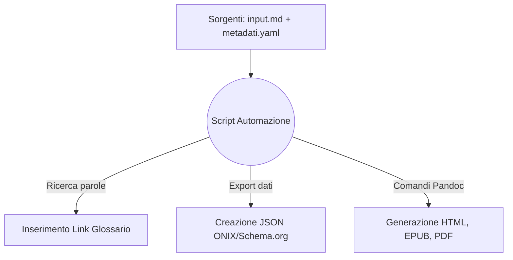

# One Health & Futuro Digitale: Dossier Strategico
## Analisi multidisciplinare su Salute, Clima, IA e Disinformazione per i professionisti dell'informazione

## Introduzione

In questo progetto presento la realizzazione di un flusso editoriale digitale automatizzato. L'obiettivo è la creazione di un "Dossier Strategico" incentrato su tematiche scientifiche attuali, pensato per rispondere alle necessità pratiche di giornalisti, redattori web e divulgatori che hanno bisogno di informazioni verificate e facili da consultare.

L'intero sistema è stato progettato seguendo il paradigma del *Single Source Publishing* (SSP). Attraverso uno script Python, un unico file di testo scritto in Markdown viene elaborato per generare in automatico e contemporaneamente tre formati finali: un sito web statico (Web-Book in HTML), un e-book in formato EPUB e un documento PDF pronto per la stampa. L'infrastruttura si occupa anche di estrarre in autonomia i metadati descrittivi del libro nei formati ONIX e Schema.org. I codici, i comandi di conversione e le logiche utilizzate per l'automazione sono esattamente quelli illustrati dal docente a lezione, che ho riadattato e riassemblato per farli funzionare in modo fluido e sequenziale all'interno di questo specifico flusso di lavoro.

## Ideazione 

### Tema
Per il contenuto del dossier ho scelto il paradigma "One Health", ovvero il concetto che la salute umana, quella animale e l'ambiente naturale sono parte di un unico grande sistema interconnesso. È un tema centrale e molto discusso attualmente, ma spesso soggetto a disinformazione.

Attorno a questo argomento, ho suddiviso il testo in sette capitoli:
1. **Salute Globale:** Il legame tra la distruzione degli ecosistemi e la diffusione di nuove malattie (zoonosi).
2. **Intelligenza Artificiale:** L'uso dei dati in medicina e il rischio dei pregiudizi algoritmici.
3. **Crisi Climatica:** Come valutare scientificamente i singoli eventi meteorologici estremi.
4. **Agricoltura Sostenibile:** Le tecniche di coltivazione che aiutano a trattenere il carbonio nel suolo.
5. **Disinformazione:** Come si diffondono le notizie false e come difendersi (prebunking).
6. **Transizione Energetica:** L'impatto reale delle tecnologie rinnovabili.
7. **Open Science:** L'importanza di condividere i dati per una ricerca più trasparente.

### Destinatari e Scenari d'Uso
Ho progettato i contenuti e i formati di output pensando a due profili professionali (archetipi):

* **Il Redattore Web:** Lavora nelle redazioni dei giornali online. Ha scadenze strette e deve scrivere di scienza senza avere un background accademico specifico. 
  * *Scenario:* Dopo un evento climatico eccezionale, deve scrivere un pezzo di approfondimento. Apre il sito web del mio progetto, legge un'introduzione chiara al problema e trova il riassunto di tre studi autorevoli. Usa i link diretti per scaricare i paper gratuiti e riesce a finire il suo articolo in tempo, assicurandosi di riportare fonti certe.
* **Il Divulgatore:** Crea contenuti didattici, newsletter o corsi di formazione. Cerca materiali ben organizzati da studiare con calma.
  * *Scenario:* Mentre viaggia in treno, legge il dossier sul suo e-reader. Grazie al formato EPUB, naviga comodamente tra i capitoli. Quando incontra una parola difficile, preme sul link e legge la spiegazione nel glossario. La struttura logica a capitoli gli torna così utile che decide di usarla come scaletta per la sua prossima lezione o newsletter.

### Requisiti di accettazione
Per ritenere il progetto valido e funzionante, ho rispettato i seguenti paletti:
* **Separazione tra testo e grafica:** Il file Markdown contiene solo il contenuto puro. Qualsiasi indicazione su colori, margini o spaziature è gestita a parte.
* **E-book leggibile ovunque:** L'EPUB deve adattarsi a qualsiasi schermo e permettere all'utente di cambiare colore di sfondo (es. Modalità Notte) senza rompere l'impaginazione.
* **Metadati standard:** I file con le informazioni del libro (JSON) devono essere scritti in modo corretto per poter essere letti senza errori dai cataloghi digitali e dai motori di ricerca.

## Processo di Produzione

### Acquisizione dei contenuti e ruolo dell'Intelligenza Artificiale
Gli articoli scientifici usati come fonte sono stati recuperati da Google Scholar e PubMed, selezionando solo materiale con licenza Open Access. La sintesi, la struttura logica e la scrittura dei testi in italiano sono state realizzate interamente da me, per garantire che il linguaggio fosse corretto e adatto al pubblico giornalistico di riferimento.

In questo progetto l'Intelligenza Artificiale (nello specifico Gemini) è stata utilizzata in modo consapevole e non massiccio. L'IA è intervenuta esclusivamente per due compiti mirati: la creazione grafica dell'immagine di copertina e come supporto tecnico per risolvere alcuni piccoli errori di sintassi durante la scrittura dello script in Python. Tutto il ragionamento logico, l'architettura dei file e il riassemblaggio dei codici sono frutto di lavoro e studio autonomo.

### Scelte grafiche e di stile
Per quanto riguarda l'aspetto visivo del progetto, ho preferito mantenere un approccio semplice, pulito e funzionale, senza complicare eccessivamente il codice. Le scelte sono state guidate dai principi visti a lezione:
* **Per il sito web (HTML):** Ho creato un foglio di stile (CSS) molto lineare. Ho usato sfondi chiari, testo scuro e titoli in evidenza, per rendere la lettura su schermo ordinata e simile a quella di un documento o report aziendale (come illustrato nel documento del corso *LM6-WebBook.pdf*).
* **Per l'e-book (EPUB):** Ho deciso di togliere qualsiasi colore o sfondo fisso. Il foglio di stile dà solo indicazioni su quanto devono essere distanti i paragrafi. In questo modo garantisco che, se l'utente attiva la "Modalità Notte" sul proprio dispositivo, il testo diventi bianco su sfondo nero in modo naturale, evitando fastidiosi rettangoli bianchi illeggibili (applicando le buone pratiche discusse in *LM5-LibroElettronico.pdf*).
* **Per il PDF:** Ho lasciato la gestione dell'impaginazione direttamente al motore LaTeX, che crea in automatico un documento dall'aspetto classico e professionale, con testo ben giustificato e margini corretti per un'eventuale stampa (facendo riferimento a *LT7-FormatiMarcatura-Latex.pdf*).

### Il flusso di automazione e l'uso dei codici del corso
L'intero flusso di lavoro è contenuto nello script `main.py`. Per realizzarlo ho ripreso esattamente i comandi, le espressioni e le logiche spiegate nei materiali del docente, mettendole in sequenza logica per questo specifico progetto:

1. **Gestione del Testo (Markdown):** Lo script legge il file `input.md` (formattato secondo la sintassi di *LT2-FormatiMarcatura-MarkDown.pdf*). Attraverso una funzione di ricerca, individua le parole del glossario e inserisce da solo i collegamenti cliccabili, facendomi risparmiare il tempo di inserirli a mano.
2. **Estrazione dei Metadati:** I dati descrittivi scritti nel file di configurazione YAML vengono mappati e convertiti in automatico in file JSON strutturati (standard ONIX e Schema.org), applicando i concetti visti in *LM4-FlussiLavoroEditoriale-Metadati.pdf*.
3. **Copia dei File Grafici:** Lo script prende il foglio di stile del sito e lo copia fisicamente nella cartella di destinazione, in modo che la pagina HTML trovi sùbito le regole grafiche e non venga visualizzata in modo scorretto.
4. **Compilazione con Pandoc:** Infine, viene richiamato Pandoc. Lo script gli passa i comandi esatti forniti a lezione (esplorati in *LT6-TrasformazioniFormati-Pandoc.pdf*) per unire il testo, la copertina e la bibliografia, generando contemporaneamente la pagina HTML, il file EPUB e il documento PDF.

## Valutazione dei risultati raggiunti

### Vantaggi del flusso proposto
* **Riduzione dei tempi:** L'intero processo di generazione dei file finali richiede meno di 3 secondi dall'avvio dello script.
* **Riduzione degli errori:** Il vantaggio principale del paradigma esplorato (illustrato in *LM3-ProcessoEditoriale.pdf*) è che tutto il testo risiede in un solo file. Se c'è un errore, lo correggo solo lì e si propaga da solo su web, e-book e PDF senza fare incollaggi manuali.
* **Semplicità e Manutenzione:** I codici riadattati dalle lezioni si sono dimostrati estremamente solidi. La manutenzione del progetto è minima, perché la grafica e il contenuto vivono in due ambienti separati.

### Confronto con il metodo tradizionale
In un flusso di lavoro classico (ASIS), avrei usato Word per impaginare il PDF, copiato a mano il testo su WordPress per fare il sito, e usato un programma come Calibre per fare l'e-book. Un piccolo refuso mi avrebbe obbligato a riaprire tre programmi diversi per fare la stessa identica correzione. 
Nel flusso che ho implementato (TOBE), lavoro solo ed esclusivamente sul file sorgente Markdown. Una volta salvato il testo, mi basta avviare lo script e tutti i formati si aggiornano simultaneamente.

### Limiti emersi
Il limite principale di questo sistema è che richiede che sul computer siano installati diversi programmi (come Python, Pandoc e l'intera e pesante libreria LaTeX). Inoltre, il PDF creato tramite LaTeX non eredita automaticamente i file CSS usati per le pagine web, il che mi ha obbligato a specificare i margini e l'aspetto della stampa direttamente all'interno delle istruzioni YAML.

## Conclusioni
Gli obiettivi posti all'inizio del progetto sono stati raggiunti con successo. Il "Dossier Strategico" è uno strumento editoriale pratico, verificato e multicanale. Aver utilizzato e riassemblato i codici forniti nel corso mi ha permesso di creare un'automazione stabile, eliminando gran parte della frustrazione legata all'impaginazione manuale. L'utilizzo mirato dell'Intelligenza Artificiale mi ha fatto risparmiare tempo su problemi tecnici, lasciandomi il totale controllo sulla redazione dei contenuti. In futuro, sarebbe interessante spostare questo meccanismo su un server remoto (come GitHub Actions) per far sì che la generazione dei file avvenga direttamente online ad ogni salvataggio, senza alcun bisogno di avere programmi installati sul PC.

## Bibliografia e sitografia

* Articoli scientifici Open Access recuperati dai database e indicizzati nel file `bibliografia.bib`.
* Materiale didattico del corso di Editoria Digitale (Università degli Studi di Milano). In particolare sono stati determinanti per la strutturazione dei codici e dell'automazione i seguenti documenti:
  * *LT2-FormatiMarcatura-MarkDown.pdf* (Per la sintassi testuale del sorgente)
  * *LM3-ProcessoEditoriale.pdf* (Per le logiche di multicanalità e Single Source Publishing)
  * *LM4-FlussiLavoroEditoriale-Metadati.pdf* (Per la configurazione YAML e l'estrazione in Schema.org e ONIX)
  * *LM5-LibroElettronico.pdf* (Per il design fluido e le buone pratiche per il formato EPUB)
  * *LM6-WebBook.pdf* (Per i concetti di pubblicazione e struttura Web)
  * *LT6-TrasformazioniFormati-Pandoc.pdf* (Per il workflow manager e i comandi esatti di compilazione Pandoc)
  * *LT7-FormatiMarcatura-Latex.pdf* (Per la gestione del motore tipografico per il PDF)