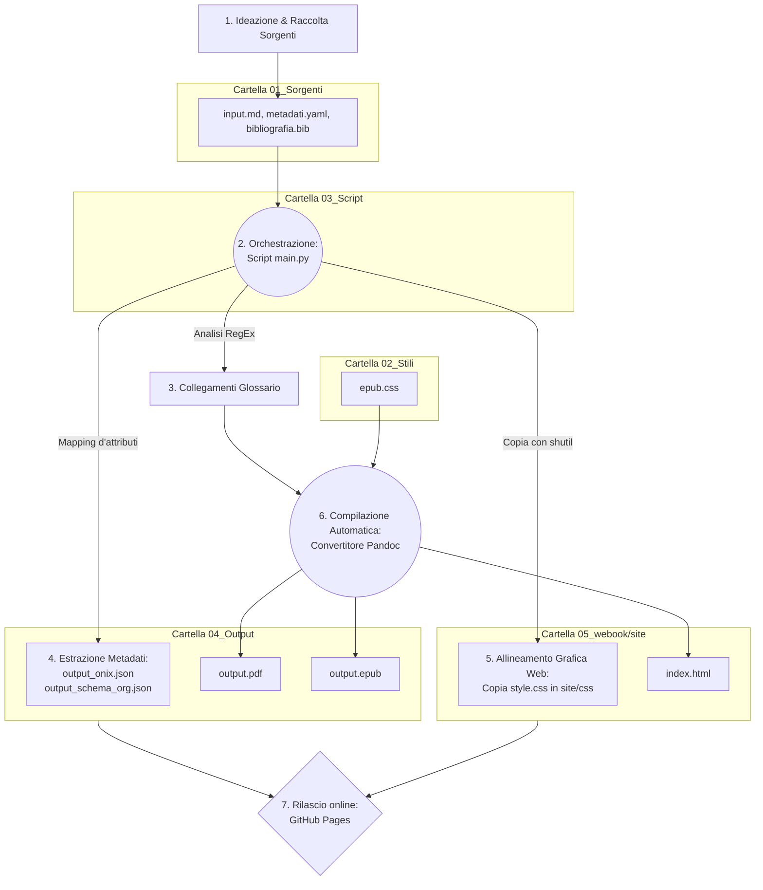

# One Health & Futuro Digitale: Dossier Strategico
## Analisi multidisciplinare su Salute, Clima, IA e Disinformazione per i professionisti dell'informazione

## Introduzione

Il presente progetto d'esame descrive la progettazione e lo sviluppo tecnico di un flusso editoriale digitale completamente automatizzato. L'obiettivo primario è la creazione di un "Dossier Strategico" tematico, pensato per rispondere alle necessità operative di giornalisti, redattori web e divulgatori, offrendo loro un aggiornamento rapido e basato su fonti certe riguardo a questioni scientifiche complesse e attuali.

Dal punto di vista tecnologico, l'intero lavoro si basa sul paradigma del *Single Source Publishing* (SSP). Attraverso lo sviluppo di uno script in Python 3, un'unica sorgente testuale in formato Markdown viene elaborata e arricchita in modo del tutto automatico. Il sistema coordina le operazioni del convertitore Pandoc per generare in simultanea tre formati finali indipendenti: un sito web statico (Web-Book in HTML), un e-book in formato EPUB e un documento impaginato in PDF per la stampa. 

Parallelamente alla generazione dei documenti, il sistema estrae in autonomia i metadati descrittivi dell'opera secondo gli standard internazionali ONIX e Schema.org. I risultati ottenuti dimostrano che l'automazione permette di azzerare gli errori di copiatura dei dati, mantenendo una netta separazione tra il contenuto scritto e il suo aspetto grafico.

## Ideazione 

### Tema
Per la scelta del tema centrale, l'analisi si è concentrata sulle questioni scientifiche più discusse e polarizzanti dell'attuale dibattito pubblico. Il filo conduttore dell'opera è il paradigma "One Health", ovvero la consapevolezza che la salute umana, quella animale e la tutela degli ecosistemi siano un sistema strettamente interconnesso.

Attorno a questo nucleo, il dossier è stato strutturato in sette capitoli che affrontano le emergenze e le innovazioni contemporanee:
1. **Salute Globale:** Il legame tra la distruzione degli ecosistemi e la diffusione delle zoonosi.
2. **Intelligenza Artificiale:** Il problema dell'opacità ("Black Box") e dei bias algoritmici in medicina.
3. **Crisi Climatica:** L'uso della moderna "scienza dell'attribuzione" per valutare gli eventi meteorologici estremi.
4. **Agricoltura Sostenibile:** La biofisica del suolo, le tecniche di lavorazione *no-till* e il sequestro del carbonio.
5. **Disinformazione:** Come si diffondono le fake news e come contrastarle tramite la strategia del *prebunking*.
6. **Transizione Energetica:** L'impatto reale delle tecnologie rinnovabili studiato attraverso il loro ciclo di vita (LCA).
7. **Open Science:** La trasparenza dei dati e dei preprint per rispondere alla crisi di riproducibilità della ricerca scientifica.

### Destinatari
Per calibrare il linguaggio e la struttura dei formati, i destinatari del prodotto editoriale sono stati definiti tramite due archetipi professionali (*personas*), inseriti in scenari d'uso concreti:

* **Archetipo 1: Il Redattore Editoriale Generalista.** * *Caratteristiche:* Opera all'interno di testate giornalistiche online, gestisce scadenze molto strette e deve scrivere articoli su argomenti complessi senza avere una formazione scientifica specifica. 
  * *Scenario d'uso:* A seguito di un evento climatico anomalo, il redattore deve scrivere un pezzo di approfondimento. Accedendo al Web-Book tramite browser, trova sùbito un'introduzione chiara al tema e la sintesi di tre studi estratti da *Nature* e *Science*. Grazie ai link diretti, può consultare le fonti Open Access senza imbattersi in paywall, riuscendo a confezionare un articolo rigoroso in meno di un'ora.
* **Archetipo 2: Il Divulgatore o Curatore di Newsletter.** * *Caratteristiche:* Professionista o formatore che cerca costantemente materiali affidabili e ben strutturati da utilizzare come base per i propri contenuti settimanali.
  * *Scenario d'uso:* Durante un viaggio, il divulgatore legge il dossier sul suo e-reader e-ink. Sfruttando la versione EPUB, naviga agevolmente tra i capitoli usando l'indice ipertestuale. Trova le parole tecniche direttamente collegate al glossario tramite gli apici cliccabili e decide di usare la struttura modulare del testo come scaletta logica per la sua prossima newsletter.

### Requisiti di accettazione
Per essere considerato valido e pronto per la distribuzione, il progetto deve soddisfare i seguenti requisiti tecnici:
* **Separazione tra logica e grafica:** Il file sorgente Markdown deve contenere esclusivamente testo. Le regole su margini, font e colori devono essere gestite unicamente da fogli di stile CSS esterni.
* **Accessibilità dell'e-book:** Il formato EPUB non deve presentare colori forzati, adattandosi nativamente alle impostazioni dell'utente (come la Modalità Notte) senza comprometterne la leggibilità.
* **Metadati standardizzati:** I file ONIX e Schema.org esportati devono presentare una sintassi JSON valida per consentire la corretta indicizzazione da parte dei motori di ricerca e dei cataloghi.
* **Integrità dei collegamenti:** Tutti i riferimenti al glossario, le citazioni bibliografiche e i link a fonti esterne devono essere attivi e precisi.

### Canali di distribuzione
Il sistema è stato progettato per generare tre output, ottimizzati per specifici canali:
1. **Canale Web (Sito HTML):** Il file `index.html` all'interno della cartella `site/`. Utilizza il foglio di stile `style.css` per simulare l'aspetto di un report scientifico, con un layout strutturato, testi in grigio ardesia e titoli blu navy, inserendo indici e riassunti all'interno di appositi riquadri.
2. **Canale E-Reader (E-book):** Il file `output.epub`. Per questo formato è stato scelto un approccio minimale tramite il file `epub.css`. Evitando colori di sfondo o testi forzati, il documento risulta fluido e si adatta automaticamente all'inchiostro elettronico e alle preferenze del lettore.
3. **Canale Stampa (Documento PDF):** Il file `output.pdf`. Viene generato tramite il motore tipografico XeLaTeX e rispetta le regole classiche dell'impaginazione formale: testo giustificato, margini ampi, interlinea comoda e salti di pagina automatici prima di ogni capitolo.

## Processo di Produzione

### Acquisizione dei contenuti
La ricerca delle fonti si è svolta utilizzando database accademici come Google Scholar e PubMed Central. Sono stati selezionati 21 paper scientifici recenti, scelti rigorosamente tra quelli provvisti di licenza Open Access (CC-BY).

Valutando l'investimento di risorse nel flusso:
* Le fonti accademiche e i software utilizzati (Python, Pandoc) sono open source e a costo zero.
* L'estrazione dei metadati e la formattazione della bibliografia avvengono in automatico, azzerando i tempi di formattazione manuale.
* Il costo maggiore, in termini di tempo, è stato richiesto dalla fase redazionale umana: lo studio dei paper in lingua inglese e la loro sintesi all'interno del file `input.md` ha richiesto attenzione per rendere i concetti chiari a un pubblico non specializzato.

### Gestione documentale
Al fine di evitare errori e passaggi ripetitivi, l'intero ciclo documentale è stato centralizzato nello script `main.py`. Il processo segue queste fasi:

1. **Lettura Sorgenti:** Lo script recupera il testo da `input.md` e i dati editoriali dal file `metadati.yaml`.
2. **Pre-processing Redazionale:** Tramite l'uso di espressioni regolari (RegEx), Python pulisce il testo e individua le parole chiave appartenenti al glossario. Alla prima occorrenza di un termine, lo script inietta in automatico la sintassi necessaria a creare il link ipertestuale, restituendo un file temporaneo arricchito senza richiedere inserimenti a mano.
3. **Estrazione Metadati:** I dati dello YAML vengono tradotti in dizionari Python e salvati come file JSON (ONIX e Schema.org) nella cartella di output.
4. **Allineamento Grafica Web:** Sfruttando le librerie di sistema, lo script copia fisicamente il file `style.css` dalla cartella degli stili alla directory del sito web, garantendo che la pagina HTML carichi sempre la grafica corretta senza link interrotti.
5. **Compilazione Multiformato:** Viene invocato Pandoc, a cui vengono passati in input il testo temporaneo, la copertina, i fogli di stile e il database bibliografico. Il motore fonde gli elementi e genera in simultanea l'HTML, l'EPUB e il PDF.
6. **Pulizia:** Il file di testo temporaneo viene eliminato dal sistema per lasciare la cartella pulita.



### Tecnologie adottate
Sono state selezionate tecnologie standard, leggere e interoperabili:
* **Markdown (`.md`):** Ha permesso la stesura del testo concentrandosi esclusivamente sul contenuto logico, svincolando del tutto la scrittura dalle logiche di impaginazione.
* **YAML (`.yaml`):** Utilizzato come file di configurazione per gestire i dati descrittivi dell'opera e le direttive per la compilazione in un formato facilmente leggibile.
* **Python 3:** Selezionato come motore di automazione. Il modulo `re` ha permesso la manipolazione istantanea del testo, mentre il modulo `shutil` ha garantito lo spostamento automatico dei fogli di stile nel file system.
* **Pandoc e XeLaTeX:** Pandoc è stato impiegato come convertitore. L'estensione `citeproc` ha tradotto il database `.bib` in una bibliografia perfettamente formattata a fine documento. Il motore XeLaTeX ha gestito la resa tipografica del PDF, assicurando una qualità accademica.

### Utilizzo di intelligenza artificiale generativa
La ricerca delle fonti scientifiche e la stesura del contenuto sono state eseguite interamente in autonomia. L'Intelligenza Artificiale generativa è stata integrata nel flusso esclusivamente con il ruolo di supporto tecnico alla programmazione. 

L'interazione è avvenuta per tre scopi principali:
1. **Sintassi Python (RegEx):** È stato richiesto supporto all'IA per formulare espressioni regolari sicure, capaci di applicare i collegamenti ipertestuali al glossario solo ed esclusivamente alla prima occorrenza di un termine in un paragrafo, evitando così ripetizioni fastidiose.
2. **Debugging CSS:** Le specifiche del formato EPUB sono state analizzate con l'IA per rimuovere i vincoli cromatici dai fogli di stile, risolvendo i problemi di visualizzazione che emergevano quando l'e-book veniva aperto in Modalità Notte.
3. **Validazione dei grafici:** Controllo e correzione della sintassi per la corretta generazione del diagramma di flusso in linguaggio Mermaid.

L'uso dell'IA ha abbattuto i tempi di sviluppo dello script, ma ha richiesto una costante supervisione. È stato indispensabile eseguire continui test da terminale per verificare il codice e correggere occasionali "allucinazioni" (come la generazione di percorsi di cartelle inesistenti o l'uso di parametri deprecati).

## Valutazione dei risultati raggiunti

### Valutazione del flusso di produzione
L'infrastruttura automatizzata implementata ha ampiamente soddisfatto gli obiettivi prefissati:
* **Riduzione dei tempi:** L'aggiornamento e la generazione dell'intero catalogo (Web, EPUB, PDF, JSON) richiede ora meno di tre secondi, equivalenti al tempo di esecuzione dello script Python.
* **Riduzione degli errori:** La centralizzazione dei dati e la gestione algoritmica dei link hanno di fatto azzerato i tipici errori di distrazione o di mancato allineamento tra le varie versioni.
* **Qualità documentale:** Rimuovendo i tag di stile dall'interno del file, il sorgente Markdown è risultato estremamente pulito. 
* **Nuovi canali:** La separazione dei CSS ha permesso di presidiare in modo ottimale sia la lettura su monitor PC (con un design strutturato) sia l'esperienza nativa su dispositivi e-ink (con un design fluido e privo di contrasti forzati).

### Confronto con lo stato dell'arte
Un confronto metodologico chiarisce i vantaggi del progetto:
* **Flusso ASIS (Tradizionale):** L'autore scrive l'opera, la impagina in PDF con software come Word o InDesign. Per pubblicare sul web, deve copiare e formattare i testi all'interno di un CMS (es. WordPress). Per generare l'e-book, utilizza un ulteriore software (es. Calibre). La correzione di un semplice refuso richiede la modifica manuale su tre programmi differenti, moltiplicando i tempi e il rischio di dimenticanze.
* **Flusso TOBE (Il progetto SSP proposto):** L'unica sorgente è il file `input.md`. Ogni correzione o aggiunta viene effettuata una singola volta. Avviando lo script, l'infrastruttura rigenera e riallinea in automatico il sito web, l'e-book, il PDF e i metadati, garantendo un aggiornamento immediato e privo di errori.

### Limiti emersi
Il sistema presenta tuttavia alcune limitazioni tecniche. Il flusso dipende strettamente dall'ambiente locale e richiede l'installazione preventiva sulla macchina delle dipendenze necessarie (Python 3, Pandoc e la libreria XeLaTeX). Inoltre, nella generazione del formato PDF, il motore LaTeX non permette di ereditare direttamente le regole grafiche scritte in formato CSS; si è reso quindi necessario gestire le regole di impaginazione per la stampa all'interno del blocco di configurazione YAML del file sorgente.

## Conclusioni
Gli obiettivi definiti in fase di ideazione sono stati raggiunti. Il "Dossier Strategico" si è dimostrato un prodotto solido, documentato e multicanale, perfettamente in target con le necessità degli operatori dell'informazione. L'applicazione del paradigma Single Source Publishing ha svincolato la fase di scrittura dalle logiche di impaginazione, migliorando nettamente l'efficienza del flusso produttivo. L'aspetto di maggior successo risiede nell'efficace separazione della logica grafica, che opera ora in totale armonia con le caratteristiche dei diversi dispositivi di lettura. Come sviluppo futuro, si prospetta la migrazione dello script su server cloud (tramite GitHub Actions), per abilitare la compilazione e la pubblicazione automatica ad ogni salvataggio, rendendo il flusso del tutto indipendente dal computer dell'autore.

## Bibliografia e sitografia

```bibtex
@book{pandoc2026,
  title = {Pandoc User's Guide},
  author = {MacFarlane, John},
  year = {2026},
  url = {[https://pandoc.org/MANUAL.html](https://pandoc.org/MANUAL.html)}
}

@book{markdown2004,
  title = {Markdown Syntax Documentation},
  author = {Gruber, John},
  year = {2004},
  url = {[https://daringfireball.net/projects/markdown/](https://daringfireball.net/projects/markdown/)}
}
```

* Articoli scientifici Open Access censiti all'interno del database bibliografico `bibliografia.bib` (comprendenti paper peer-reviewed estratti da testate di rilievo quali *Nature*, *Science* ed *eLife*).
* Materiale didattico, slide e appunti ufficiali del corso di *Editoria Digitale* tenuto dal Prof. Ceravolo Paolo (Università degli Studi di Milano).
* Documentazione ufficiale del linguaggio Python 3, con focus specifico sulle operazioni relative ai moduli di manipolazione testuale (`re`) e gestione dei file a livello di sistema operativo (`shutil`).